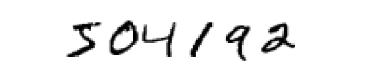

#### 原文翻译
##### 第1章 使用神经网络识别手写数字 
人类视觉系统是世界奇迹之一。考虑以下手写数字序列：

大多数人毫不费力地将这些数字识别为 504192。这种轻松具有欺骗性。在我们大脑的每个半球中，人类都有一个初级视觉皮层，也称为 V1，包含 1.4 亿个神经元，它们之间有数百亿个连接。然而，人类视觉不仅涉及 V1，还涉及整个视觉皮层系列 - V2、V3、V4 和 V5 - 进行逐渐复杂的图像处理。我们的大脑中装有一台超级计算机，经过数亿年的进化调整，非常适合理解视觉世界。识别手写数字并不容易。相反，我们人类非常擅长理解我们眼睛所看到的东西。但几乎所有这些工作都是在不知不觉中完成的。因此，我们通常不会意识到我们的视觉系统解决的问题有多么困难。

如果您尝试编写计算机程序来识别上述数字，那么视觉模式识别的难度就会变得显而易见。当我们自己做的时候，看似容易的事情突然变得极其困难。关于我们如何识别形状的简单直觉——“9 的顶部有一个圈，右下角有一个竖线”——结果用算法来表达并不那么简单。当您试图使这些规则变得精确时，您很快就会迷失在例外、警告和特殊情况的泥潭中。看来是无望了。

神经网络以不同的方式解决这个问题。这个想法是采用大量手写数字，称为训练示例，

然后开发一个可以从这些训练示例中学习的系统。换句话说，神经网络使用示例来自动推断识别手写数字的规则。此外，通过增加训练示例的数量，网络可以更多地了解手写内容，从而提高其准确性。因此，虽然我上面只展示了 100 个训练数字，但也许我们可以通过使用数千甚至数百万或数十亿个训练示例来构建更好的手写识别器。

在本章中，我们将编写一个计算机程序来实现一个学习识别手写数字的神经网络。该程序只有 74 行长，并且没有使用特殊的神经网络库。但这个短程序可以识别数字，准确率超过 96%，无需人工干预。此外，在后面的章节中，我们将提出可以将准确率提高到 99% 以上的想法。事实上，最好的商业神经网络现在非常好，银行用它们来处理支票，邮局用它们来识别地址。

我们专注于手写识别，因为它是学习一般神经网络的一个很好的原型问题。作为一个原型，它达到了最佳点：它具有挑战性 - 识别手写数字不是一件小事 - 但它并不难到需要极其复杂的解决方案或巨大的计算能力。此外，这是开发更先进技术（例如深度学习）的好方法。因此，在整本书中，我们将反复讨论手写识别问题。在本书的后面，我们将讨论如何将这些想法应用于计算机视觉以及语音、自然语言处理和其他领域的其他问题。

当然，如果本章的重点只是编写一个计算机程序来识别手写数字，那么这一章就会短得多！但在此过程中，我们将发展许多关于神经网络的关键思想，包括两种重要类型的人工神经元（感知器和 S 型神经元），以及神经网络的标准学习算法（称为随机梯度下降）。在整个过程中，我重点解释为什么事情是这样完成的，并建立你的神经网络直觉。这需要比我只介绍正在发生的事情的基本机制更长的讨论，但为了您获得更深入的理解，这是值得的。在收获中，到本章结束时，我们将能够理解深度学习是什么以及它为何重要。

##### 感知器(Perceptrons)
什么是神经网络？首先，我将解释一种称为感知器的人工神经元。感知器是由科学家 Frank Rosenblatt 在 20 世纪 50 年代和 1960 年代开发的，其灵感来自 Warren McCulloch 和 Walter Pitts 的早期工作。如今，使用其他人工神经元模型更为常见 - 在本书以及许多现代神经网络研究中，使用的主要神经元模型是 S 型神经元。我们很快就会讨论乙状结肠神经元。但要理解为什么 S 型神经元是这样定义的，值得花时间首先了解感知器。

那么感知器是如何工作的呢？感知器接受多个二进制输入$ x_1,x_2,… $，并生成单个二进制输出：

在所示的示例中，感知器有三个输入。$x_1,x_2,x_3$。一般情况下，它可能具有更多或更少的输入。Rosenblatt提出了一个简单的规则来计算输出。他介绍了权重$w_1,w_2……$表示输入对输出的重要性。然后，神经元的输出值为 0 或 1，取决于加权和$ ∑_j w_j x_j $是否小于或大于某个阈值。与权重一样，阈值是神经元的一个参数，它是一个实数。更精确地说，可以表述为：
\[
\text{output} = 
\begin{cases} 
0 & \text{if } \sum_{j} w_{j}x_{j} \leq \text{threshold} \\
1 & \text{if } \sum_{j} w_{j}x_{j} > \text{threshold}
\end{cases}(1)
\]
感知器是如何工作的，就是这些内容了！

这就是基本的数学模型。您可以这样理解感知器：它是一种通过权衡证据做出决策的设备。让我举个例子。这不是一个非常现实的例子，但是很容易理解，我们很快就会看到更现实的例子。假设周末即将到来，您听说您所在的城市将举办奶酪节。您喜欢奶酪，正在考虑是否参加这个节日。您可以通过权衡三个因素来做出决定：

1. 天气好吗？
2. 你的男朋友或女朋友想陪你吗？
3. 音乐节附近有公共交通吗？ （您没有汽车）。

我们可以用相应的二进制变量$ x_1、x_2$ 和 $x_3 $来表示这三个因素。例如，如果天气很好，我们会有 $x_1 = 1$，如果天气不好，就有$ x_1 = 0$。同样，如果你的男朋友或女朋友想去，$x_2 = 1$，否则为$ x_2 = 0$。对于 $x_3 $和公共交通也是类似的。

现在，假设您非常喜欢奶酪，以至于即使您的男朋友或女朋友不感兴趣并且很难去参加节日，您也很乐意去参加节日。但也许你真的很讨厌坏天气，如果天气不好你就不可能去参加音乐节。您可以使用感知器来模拟此类决策。

一种方法是为天气选择权重 $w_1=6$ ，为其他条件选择 $w_2=2$ 和 $w_3=2$ 。 $w_1$ 的值越大，表明天气对您来说越重要，远比您的男朋友或女朋友是否加入您或公共交通的远近重要得多。最后，假设您为感知器选择阈值 5 。通过这些选择，感知器实现所需的决策模型，每当天气好的时候输出 1 ，每当天气不好的时候输出 0 。无论你的男朋友或女朋友是否想去，或者附近是否有公共交通，这对输出都没有影响。

通过改变权重和阈值，我们可以获得不同的决策模型。例如，假设我们选择了阈值 3 。然后，感知器会决定，只要天气好，或者节日靠近公共交通并且你的男朋友或女朋友愿意加入你，你就应该去参加节日。换句话说，这将是一种不同的决策模式。降低门槛意味着你更愿意去参加节日。

显然，感知器并不是人类决策的完整模型！但这个例子说明了感知器如何权衡不同类型的证据以做出决策。复杂的感知器网络可以做出相当微妙的决定，这似乎是合理的：

在这个网络中，感知器的第一列 - 我们称之为感知器的第一层 - 通过权衡输入证据做出了三个非常简单的决定。那么第二层的感知器呢？这些感知器中的每一个都是通过权衡来自第一层决策的结果来做出决定的。这种方式，第二层中的感知器可以在比第一层感知器更复杂和更抽象的水平上做出决策。甚至更复杂的决策可以由第三层的感知器做出。这样，一个由多层感知器组成的网络可以进行复杂的决策。

顺便说一句，当我定义感知器时，我说过感知器只有一个输出。在上面的网络中，感知器看起来有多个输出。事实上，它们仍然是单输出。多个输出箭头只是指示感知器的输出被用作几个其他感知器的输入的有用方式。它比绘制一条然后分开的输出线更方便。

让我们简化描述感知器的方式。条件 $∑_jw_jx_j>threshold$ 很麻烦，我们可以做两个符号上的改变来简化它。第一个更改是将$ ∑_jw_jx_j $写为点积 $w⋅x≡∑_jw_jx_j$ ，其中 $w$ 和 $x$ 是向量，其分量是权重和分别输入。第二个更改是将阈值移至不等式的另一侧，并将其替换为感知器偏差$ b≡−threshold$ 。使用偏差而不是阈值，可以重写感知器规则：
\[
\text{output} = 
\begin{cases} 
0 & \text{if } w \cdot x + b \leq 0 \\
1 & \text{if } w \cdot x + b > 0
\end{cases}(2)
\]

您可以将偏差视为衡量感知器输出 1 难易程度的指标。或者用更生物学的术语来说，偏差是衡量感知器启动的难易程度的指标。对于具有很大偏差的感知器，感知器非常容易输出 1 。但如果偏差非常负，那么感知器就很难输出 1 。显然，引入偏差只是我们描述感知器方式的一个小变化，但我们稍后会看到它会导致符号的进一步简化。因此，在本书的其余部分中，我们不会使用阈值，我们将始终使用偏差。

我将感知器描述为一种权衡证据以做出决策的方法。感知器的另一种使用方式是计算我们通常认为是底层计算的基本逻辑函数，例如 AND 、 OR 和 NAND 等函数。例如，假设我们有一个具有两个输入的感知器，每个输入都有权重 −2 ，总体偏差为 3 。这是我们的感知器：

然后我们看到，输入00 产生输出1，因为$(−2) * 0 + (−2) * 0 + 3 = 3 $是正的。 在这里，我引入了* 符号，以使乘法显示出来。 类似的计算显示，输入01 和10 产生输出1。 但输入11 产生输出0，因为$(−2) * 1 + (−2) * 1 + 3 = −1 $是负的。 因此，我们的感知器实现了一个NAND门！

NAND示例表明我们可以使用感知器来计算简单的逻辑函数。实际上，我们可以使用感知器网络来计算任何逻辑函数。原因在于NAND门对于计算是通用的，也就是说，我们可以用NAND门构建任何计算。例如，我们可以使用NAND门构建一个添加两个位x₁和x₂的电路。这需要计算位求和，x₁⊕x₂，以及一个进位位，当x₁和x₂都为1时设为1，即进位位只是位乘积x₁x₂：

为了获得一个与感知机等效的网络，我们将所有的NAND门替换为两个输入的感知机，每个输入的权重为-2，总体偏差为3。这就是结果网络。请注意，我将底部右侧的NAND门对应的感知机稍微移动了一下，只是为了更容易地在图表上画出箭头：

感知机网络中的一个显著特点是，最左侧感知机的输出被用作最底端感知机的两倍输入。当我定义感知机模型时，我没有说这种双输出到同一位置是否被允许。实际上，这并不太重要。如果我们不想允许这种情况，那么可以简单地合并这两条线，将它们合并成一条连接，权重为-4，而不是两条权重为-2的连接。（如果你觉得这显而易见，请停下来证明这是等价的。）通过这种改变，网络如下所示，所有未标记的权重都等于-2，所有偏差都等于3，并有一条标记为-4的单一权重：

到目前为止，我一直将像x1和x2这样的输入画成浮动在感知器网络左侧的变量。 实际上，画一个额外的感知器层 - 输入层 - 用于编码输入是常规做法：

这是关于输入感知器的符号表示法，其中我们有一个输出，但没有输入。

这是一个简称。它实际上并不表示没有输入的感知器。要看到这一点，假设我们有一个没有输入的感知器。那么加权和$∑_jw_jx_j$将永远为零，因此如果$b > 0$，感知器将输出1，如果$b ≤ 0$，则输出0。也就是说，感知器将简单地输出一个固定值，而不是期望的值（如上面的$x_1$）。最好将输入感知器视为根本不是感知器，而是简单地被定义为输出期望的值$x_1，x_2，…$。

加法器示例演示了如何使用感知器网络来模拟包含多个NAND门的电路。由于NAND门是通用计算的，因此感知器也是通用计算的。

感知器的计算普适性既令人 gerong, 又令人失望。令人 gerong， 因为它告诉我们，感知器网络可以和任何其他计算设备一样强大。但是，其拙幼几乎像是一种新型 NAND 门。这几乎不是什么大新闻！

然而，情况比这种观点所暗示的要好。 原来我们可以设计学习算法，可以自动调整人工神经元网络的权重和偏差。 这种调整是针对外部刺激发生的，不需要程序员直接介入。 这些学习算法使我们能够以一种根本不同于传统逻辑门的方式使用人工神经元。 我们的神经网络不是明确地列出 NAND 和其他门的电路，而是简单地学会解决问题，有时是一些极其难以直接设计传统电路的问题。

##### Sigmoid神经元
学习算法听起来很棒。但是我们如何为神经网络设计这样的算法呢？假设我们有一个感知器网络，我们想用来学习解决一些问题。例如，网络的输入可能是来自数字的扫描手写图像的原始像素数据。我们希望网络学习权重和偏差，以便从网络的输出正确分类的数字。为了了解学习是如何工作的，假设我们在网络的某个权重(或偏差)上做一个小小的改变。我们希望这个在权重上的微小变化只引起网络输出中相应的微小变化。正如我们将要看到的，这个特性将使学习成为可能。从图表上看，这就是我们想要的(显然这个网络太简单了，不适合做手写识别!):

如果一个权重（或偏差）的微小变化只引起了输出的微小变化，那么我们可以利用这一变化来修改权重和偏差，使网络行为更符合我们的意图。例如，假设网络错误地将一幅图像分类为"8"，而其实应该是"9"。我们可以找出如何微调权重和偏差，使网络更接近将图像分类为"9"。然后我们会重复这个过程，一次又一次地改变权重和偏差，以产生更好的输出。网络将会不断地进行学习。

问题是，当我们的网络包含感知器时，情况并非如此。事实上，网络中任何单个感知器的权值或偏差的一个小变化，有时会导致该感知器的输出完全翻转，比如从0到1。这种翻转可能会导致网络其他部分的行为以某种非常复杂的方式完全改变。因此，尽管你的“9”现在可能被正确分类，但网络在所有其他图像上的行为可能已经以某种难以控制的方式完全改变了。这使得我们很难看到如何逐渐修改权重和偏差，以便网络更接近所期望的性能。也许有些聪明的办法可以解决这个问题，但我们目前还不清楚如何使感知机网络学习。

我们可以通过引入一种叫做Sigmoid神经元的新型人工神经元来克服这个问题。Sigmoid神经元类似于感知器，但是经过修改，它们的重量和偏差的微小变化只会导致它们输出的微小变化。这是使Sigmoid神经元网络学习的关键事实。

好的，让我来描述一下 S 型神经元。我们将用与感知器相同的方式来描述 S 型神经元：

就像感知器一样S形神经元也有输入$x_1,x_2......$这些输入也可以采用0和1之间的任何值，而不仅仅是0或1，比如0.638...也是S神经元的有效输入。就像感知器一样，S神经元对每个输入都有权重$w_1,w_2......$和一个总体的偏移值，b，但输出不是0或1。相反，它是$σ(w⋅x+b)$。其中σ被称为Sigmoid函数[1],并被定义为：
$$σ(z)≡\frac{1}{1+e^{−z}}(3)$$
更明确地说，具有输入$x_1,x_2......$、权重$w_1,w_2......$ 和偏置 b 的 Sigmoid 神经元的输出为：
$$\frac{1}{1+e^{-(\sum_{j}^{} w_jx_j+b)}}(4)$$

初看起来，乙状结肠神经元与感知器有很大的不同。如果你还不熟悉 S形函数的代数形式，它可能看起来晦涩难懂、令人生畏。事实上，感知器和乙状结肠神经元之间有许多相似之处，S形函数的代数形式更多的是一个技术细节，而不是真正的理解障碍。

为了理解与感知器模型的相似性，假设$z≡w⋅x+b$是一个很大的正数。然后$e^{−z}≈0$，所以$σ(z)≈1$。换句话说，当$z=w⋅x+b$很趋于正无穷时，S形神经元的输出约为1，就像对于感知器一样。另一方面，假设$z=w⋅x+b$是非常小的负数,那么$e^{−z}→∞$，所以$σ(z)≈0$。所以当$z=w⋅x+b$趋于负无穷，S形神经元的行为也与感知器非常接近。只有当$w⋅x+b$规模适中时，与感知器模型的偏差很大。

σ的代数形式是什么？我们如何理解这个？实际上，σ的确切形式并不那么重要，真正重要的是在图中绘制函数的形状。这里是形状：

这个形状是阶跃函数的平滑版本。

如果σ实际上是一个阶跃函数，那么 Sigmoid 神经元将成为一个感知器，因为输出将根据$w⋅x+b$是正还是负来确定是1还是0[2]。通过使用实际的σ函数，正如上面已经暗示的那样，我们得到了一个平滑的感知器。 确实，σ函数的平滑是关键，而不是它的详细形式。 σ的平滑意味着在权重中有小的变化$Δw_j$和偏差Δb将导致神经元输出的小变化Δoutput。 实际上，微积分告诉我们Δoutput可以很好地近似为
$$Δoutput≈\sum_{j}\frac{\partial output}{\partial w_j}Δw_j+\frac{\partial output}{\partial b}Δb (5)$$
总和计算涵盖所有权重$ w_j $和$ ∂output/∂w_j $以及 $∂output/∂b$，分别表示输出与$ w_j $和 $b$ 的偏导数。如果对于部分导数不熟悉，不要惊慌！虽然上面的表达看起来复杂，包含了所有的偏导数，实际上它传达的是非常简单（而且是个好消息）：Δoutput 是对权重和偏置的变化$Δw_j$ 和 Δb 的线性函数。这种线性关系使得选择权重和偏置的微小变化以实现任意所需的输出微小变化变得很容易。因此，虽然 S 型神经元在很大程度上与感知器表现出相同的性质，但它们更容易弄清楚如何改变权重和偏置来改变输出。

如果真正重要的是 σ 的形状，而不是其确切形式，那么为什么在方程 (3)中使用了σ的特定形式？事实上，书中稍后我们偶尔会考虑输出为$f(w⋅x+b)$的神经元，对于一些其他激活函数$f(⋅)$。当我们使用不同的激活函数时，改变的主要事情是方程(5)中偏导数的特定值会改变。事实证明，当我们稍后计算这些偏导数时，使用σ将简化代数，仅仅因为指数函数在求导时具有可爱的性质。无论如何，在神经网络的工作中σ通常被使用，并且是本书中我们最经常使用的激活函数。

我们应该如何解释来自 S 型神经元的输出？显然，感知器和 S 型神经元之间的一个重要区别是，S 型神经元不仅仅输出 0 或 1。它们可以作为输出值在 0 和 1 之间的任意实数，因此诸如 0.173… 和 0.689… 这样的数值是合法的输出。当我们希望使用输出值表示输入到神经网络的图像像素的平均强度时，这可能很有用。但有时候可能会带来麻烦。假设我们希望网络的输出指示“输入图像是 9”或“输入图像不是 9”。显然，如果输出是 0 或 1，如感知器那样，这将是最容易的。但实际上我们可以建立一种惯例来处理这种情况，例如，决定将至少为 0.5 的任何输出解释为指示“9”，将小于 0.5 的任何输出解释为指示“不是 9”。我会始终明确说明我们何时使用这样的惯例，这样就不会引起任何混乱。

###### 练习
* **仿真感知器的Sigmoid神经元，第一部分**
假设我们取感知器网络中的所有权重和偏置，并将它们乘以一个正常数 c > 0。证明网络的行为不会发生变化。
* **S型神经元模拟感知器，第二部分**
假设我们有与上一个问题相同的设置——感知器网络。还假设已经选择了感知器网络的整体输入。我们不需要实际的输入值，我们只需要输入已经固定。假设权重和偏置被选择得对于网络中任何特定感知器的输入xx来说w ⋅ x + b ≠ 0。现在用S型神经元替换网络中的所有感知器，并且将权重和偏置乘以一个正的常数 c > 0。证明当c → ∞时，这个S型神经元网络的行为与感知器网络完全相同。当$w ⋅ x + b = 0$时，感知器之一发生什么问题？

##### 神经网络的架构
在下一节中，我将介绍一个神经网络，它可以很好地对手写数字进行分类。为了为此做好准备，我们需要认识一些术语，让我们可以命名网络的不同部分。假设我们有网络：

正如之前提到的，此网络中最左边的一层称为输入层，层内的神经元称为输入神经元。最右侧或输出层包含的是输出神经元，在上图的这种情况下，一个输出层包含单个输出神经元。中间层称为隐藏层(在一些其他的教材上也被称为“全连接层”，因为该层的每个神经元与前后层的每个神经元都是相连的)，因为该层的神经元既不是输入也不是输出。"隐藏"这个术语也许听起来有点神秘 - 第一次听到这个术语时，我认为它一定有一些深奥的哲学或数学意义 - 但实际上它只是意味着"既不是输入也不是输出"。上面的网络只有一个隐藏层，但有些网络有多个隐藏层。例如，以下四层网络有两个隐藏层：

有些令人困惑的是，出于历史原因，这样的多层网络有时被称为多层感知器（MLP），尽管由Sigmoid神经元而不是感知器构成。我不打算在这本书中使用MLP术语，因为我认为这会引起混淆，但我想提醒您它的存在。

网络中输入层和输出层的设计通常很简单。例如，假设我们试图确定手写图像是否描绘了“9”。设计网络的一种自然方法是将图像像素的强度编码到输入神经元中。如果图像是 64 x 64 灰度图像，那么我们将有 4,096=64×64 个输入神经元，强度在 0 和 1 。输出层将仅包含一个神经元，输出值小于 0.5 表示“输入图像不是 9”，输出值大于 0.5 表示“输入图像是9”。

虽然神经网络的输入和输出层的设计通常很简单，但隐藏层的设计可能相当艺术。特别是，不可能用一些简单的经验法则来总结隐藏层的设计过程。相反，神经网络研究人员为隐藏层开发了许多设计启发式方法，帮助人们从网络中获得他们想要的行为。例如，此类启发式方法可用于帮助确定如何权衡隐藏层的数量与训练网络所需的时间。我们将在本书后面遇到一些这样的设计启发法。

到目前为止，我们一直在讨论神经网络，其中一层的输出用作下一层的输入。这种网络称为前馈神经网络。这意味着网络中没有环路——信息总是向前馈送，从不反馈。如果我们确实有循环，我们最终会遇到 σ 函数的输入取决于输出的情况。这很难理解，所以我们不允许这样的循环。

然而，还有其他人工神经网络模型可以实现反馈循环。这些模型称为循环神经网络。这些模型的想法是让神经元在变得静止之前在一段有限的时间内放电。这种放电可以刺激其他神经元，这些神经元可能会稍后放电，但持续时间也有限。这会导致更多的神经元放电，因此随着时间的推移，我们会得到一连串的神经元放电。在这样的模型中，循环不会引起问题，因为神经元的输出只会影响其稍后的输入，而不是立即影响。

循环神经网络的影响力不如前馈网络，部分原因是循环网络的学习算法（至少到目前为止）功能较弱。但循环网络仍然非常有趣。它们在精神上比前馈网络更接近我们大脑的工作方式。循环网络有可能解决只有前馈网络才能解决的重要问题。然而，为了限制我们的范围，在本书中我们将集中讨论更广泛使用的前馈网络。

##### 一个简单的网络来对手写数字进行分类
定义了神经网络后，让我们回到手写识别。我们可以将识别手写数字的问题分成两个子问题。首先，我们想要一种将包含许多数字的图像分解为一系列单独图像的方法，每个图像包含一个数字。例如，我们想要破坏图像：

分成六个独立的图像，

我们人类可以轻松解决这个分割问题，但计算机程序正确地分解图像却具有挑战性。一旦图像被分割，程序就需要对每个数字进行分类。因此，例如，我们希望我们的程序能够识别上面的第一个数字，

是 5。

我们将重点编写一个程序来解决第二个问题，即对各个数字进行分类。我们这样做是因为事实证明，一旦你有了对各个数字进行分类的好方法，分割问题就不那么难解决了。有很多方法可以解决分割问题。一种方法是尝试多种不同的图像分割方法，使用单独的数字分类器对每个尝试分割进行评分。如果单个数字分类器对其在所有分段中的分类充满信心，则试验分段会获得高分；如果分类器在一个或多个分段中遇到很多麻烦，则试验分段会获得低分。这个想法是，如果分类器在某个地方遇到问题，那么它可能会因为分割选择不正确而出现问题。这个想法和其他变体可以用来很好地解决分割问题。因此，我们不用担心分割，而是专注于开发一个神经网络，它可以解决更有趣和更困难的问题，即识别单个手写数字。

为了识别单个数字，我们将使用三层神经网络：

网络的输入层包含对输入像素值进行编码的神经元。如下一节所述，我们的网络训练数据将包含许多 28 x 28 扫描手写数字的像素图像，因此输入层包含 784=28×28 输入神经元。输入像素是灰度的，值 0.0 代表白色，值 1.0 代表黑色，中间值代表逐渐变暗的灰色阴影。

网络的第二层是隐藏层。我们用 n 表示该隐藏层中的神经元数量，并且我们将尝试使用 n 的不同值。所示示例说明了一个小型隐藏层，仅包含 n=15 神经元。

网络的输出层包含 10 个神经元。如果第一个神经元触发，即有一个输出 ≈1 ，那么这将表明网络认为该数字是 0 。如果第二个神经元触发，则表明网络认为该数字是 1 。等等。更准确地说，我们对从 0 到 9 的输出神经元进行编号，并找出哪个神经元具有最高的激活值。如果该神经元是神经元编号 6 ，那么我们的网络将猜测输入数字是 6 。其他输出神经元依此类推。

您可能想知道为什么我们使用 10 个输出神经元。毕竟，网络的目标是告诉我们哪个数字 ( 0,1,2,…,9 ) 对应于输入图像。一种看似自然的方法是仅使用 4 个输出神经元，将每个神经元视为采用二进制值，具体取决于神经元的输出是否更接近于 0 还是 1 。四个神经元足以对答案进行编码，因为 $2^4=16$ 超过了输入数字的 10 个可能值。为什么我们的网络应该使用 10 个神经元？这不是效率低下吗？最终的理由是经验性的：我们可以尝试这两种网络设计，事实证明，对于这个特定问题，具有 10 个输出神经元的网络比具有 4个输出神经元效果更好。是否有一些启发式方法可以提前告诉我们应该使用 10 个输出编码而不是 4个输出编码？

为了理解我们为什么这样做，从基本原理来思考神经网络正在做什么会有所帮助。首先考虑我们使用 10 个输出神经元的情况。让我们关注第一个输出神经元，它试图决定数字是否是 0 。它通过权衡来自神经元隐藏层的证据来做到这一点。那些隐藏的神经元在做什么？好吧，为了论证，假设隐藏层中的第一个神经元检测是否存在如下所示的图像：

它可以通过对与图像重叠的输入像素进行较大的加权，并且仅对其他输入进行轻微的加权来实现此目的。以类似的方式，为了论证，我们假设隐藏层中的第二个、第三个和第四个神经元检测以下图像是否存在：

正如您可能已经猜到的，这四个图像一起构成了我们在前面显示的数字行中看到的 0 图像：

因此，如果所有四个隐藏神经元都被激发，那么我们可以得出结论，该数字是 0 。当然，这并不是我们可以用来断定该图像是 0 的唯一证据 - 我们可以通过许多其他方式合法地获得 0 （例如，通过翻译以上图像，或轻微变形）。但似乎可以肯定地说，至少在这种情况下，我们可以得出输入是 0 的结论。

假设神经网络以这种方式运行，我们可以给出一个合理的解释，解释为什么网络的输出最好是 10 而不是 4 。如果我们有 4 输出，那么第一个输出神经元将尝试确定数字的最高有效位是什么。并且没有简单的方法将最重要的位与如上所示的简单形状联系起来。很难想象数字的组成形状与（例如）输出中的最高有效位密切相关有什么好的历史原因。

话虽如此，这一切都只是一种启发。没有什么说明三层神经网络必须按照我描述的方式运行，隐藏的神经元检测简单的组件形状。也许聪明的学习算法会找到一些权重分配，让我们只使用 4 输出神经元。但作为一种启发式，我所描述的思维方式非常有效，并且可以在设计良好的神经网络架构时节省大量时间。

有一种方法可以通过在上面的三层网络中添加额外的层来确定数字的按位表示。额外层将前一层的输出转换为二进制表示，如下图所示。找到新输出层的一组权重和偏差。假设神经元的前 3 层使得第三层（即旧输出层）中的正确输出至少具有 0.99 激活，并且不正确的输出具有更少的激活比 0.01 。

##### 学习梯度下降
现在我们已经设计了神经网络，它如何学习识别数字？我们需要的第一件事是一个要学习的数据集——所谓的训练数据集。我们将使用 MNIST 数据集，其中包含数万张手写数字的扫描图像及其正确的分类。 MNIST 的名称来源于它是美国国家标准与技术研究所 (NIST) 收集的两个数据集的修改子集。以下是 MNIST 的一些图像：

正如您所看到的，这些数字实际上与本章开头作为识别挑战所显示的数字相同。当然，在测试我们的网络时，我们会要求它识别不在训练集中的图像！

MNIST 数据分为两部分。第一部分包含 60,000 张图像用作训练数据。这些图像是 250 人的扫描笔迹样本，其中一半是美国人口普查局员工，一半是高中生。图像为灰度图像，大小为 28 x 28 像素。 MNIST 数据集的第二部分是 10,000 张图像，用作测试数据。同样，这些是 28 x 28 灰度图像。我们将使用测试数据来评估我们的神经网络学习识别数字的能力。为了使其成为良好的性能测试，测试数据取自与原始训练数据不同的 250 人组（尽管仍然是人口普查局员工和高中生之间的一组）。这有助于让我们相信我们的系统可以识别在训练期间没有看到的人的数字。

我们将使用符号 $x$ 来表示训练输入。将每个训练输入 $x$ 视为 $28×28=784$ 维向量会很方便。向量中的每个条目代表图像中单个像素的灰度值。我们将用 $y=y(x)$ 表示相应的所需输出，其中 $y$ 是 10 维向量。例如，如果特定训练图像 $x$ 描绘 6 ，则$ y(x)=(0,0,0,0,0,0,1,0,0,0)^T$ 是网络所需的输出。注意这里的 $T$ 是转置操作，将行向量变成普通（列）向量。

我们想要的是一种算法，它可以让我们找到权重和偏差，以便网络的输出对于所有训练输入$ x $都近似于$ y(x)$ 。为了量化我们实现这一目标的程度，我们定义了一个成本函数（有时称为损失函数或目标函数）[3]*。

这里， $w$ 表示网络中所有权重的集合， $b$ 表示所有偏差， $n$ 是训练输入的总数， $a$ 是网络输出的向量，并且总和是所有训练输入 $x$ 的总和。当然，输出 $a$ 取决于$ x$ 、 $w$ 和$ b$ ，但为了保持符号简单，我没有明确指出这种依赖。符号$ ∥v∥$ 仅表示向量$ v$ 的常用长度函数。我们将调用$ C$ 二次成本函数；有时也称为均方误差或 $MSE$。检查二次成本函数的形式，我们发现 $C(w,b)$ 是非负的，因为总和中的每一项都是非负的。此外，当 $y(x) $大约等于输出 $a$ 时，成本 $C(w,b)$ 变小，即 $C(w,b)≈0$ 。训练输入， $x$ 。因此，如果我们的训练算法能够找到权重和偏差，从而 $C(w,b)≈0$ ，那么它就做得很好了。相比之下，当 $C(w,b)$ 很大时，它的表现就不太好 - 这意味着对于大量输入， $y(x)$ 与输出 $a$ 并不接近。因此，我们训练算法的目标是最小化作为权重和偏差函数的成本$ C(w,b)$ 。换句话说，我们希望找到一组权重和偏差，使成本尽可能小。我们将使用一种称为梯度下降的算法来做到这一点。[$ C(w,b)$其实就是我们常讲的损失函数$L(w,b)$，只是这里的叫法不同而已。]

为什么引入二次成本函数（MSE）？毕竟，我们主要感兴趣的不是网络正确分类的图像数量吗？为什么不尝试直接最大化该数字，而不是最小化二次成本等代理度量？问题在于，正确分类的图像数量并不是网络中权重和偏差的平滑函数。在大多数情况下，对权重和偏差进行微小的更改不会导致正确分类的训练图像数量发生任何变化。这使得很难弄清楚如何改变权重和偏差来提高性能。如果我们使用像二次成本这样的平滑成本函数，那么很容易弄清楚如何对权重和偏差进行微小的改变，从而提高成本。这就是为什么我们首先关注最小化二次成本函数，然后才检查分类准确性。

即使我们想要使用平滑的成本函数，您可能仍然想知道为什么我们选择等式（6）中使用的二次函数。这难道不是一个相当临时的选择吗？也许如果我们选择不同的成本函数，我们会得到一组完全不同的最小化权重和偏差？这是一个合理的担忧，稍后我们将重新审视成本函数，并进行一些修改。然而，方程（6）的二次成本函数非常适合理解神经网络学习的基础知识，因此我们现在将继续使用它。

回顾一下，我们训练神经网络的目标是找到最小化二次成本函数 $C(w,b)$ 的权重和偏差。这是一个适定的问题，但它有很多目前提出的分散注意力的结构 - 将 w 和 b 解释为权重和偏差， σ 后台潜伏的功能、网络架构的选择、MNIST等等。事实证明，通过忽略大部分结构，只关注最小化方面，我们可以理解大量内容。因此，现在我们将忘记成本函数的具体形式、与神经网络的连接等等。相反，我们会想象我们只是被赋予了一个包含许多变量的函数，并且我们想要最小化该函数。我们将开发一种称为梯度下降的技术，可用于解决此类最小化问题。然后我们将回到我们想要最小化神经网络的特定函数。

好吧，假设我们正在尝试最小化某个函数 $C(v)$ 。这可以是许多变量的任何实值函数 $v=v1,v2,… $。请注意，我已将 w 和 b 符号替换为 v 以强调这可以是任何函数 - 我们并没有在神经网络中专门考虑上下文不再。为了最小化 $C(v)$ ，可以将$ C$ 想象为只有两个变量的函数(曲面函数)，我们将其称为 v1 和 v2 ：

我们想要找到 $C$ 达到其全局最小值的位置。当然，现在对于上面绘制的函数，我们可以观察图形并找到最小值。从这个意义上说，我可能展示的功能有点太简单了！通用函数$ C$ 可能是一个包含许多变量的复杂函数，通常不可能仅通过观察图形来找到最小值。

解决这个问题的一种方法是使用微积分来尝试分析地找到最小值。我们可以计算导数，然后尝试使用它们来查找 $C$ 为极值的位置。运气好的话，当 $C$ 是一个或几个变量的函数时，这可能会起作用。但当我们有更多的变量时，它就会变成一场噩梦。对于神经网络，我们通常需要更多的变量 - 最大的神经网络具有以极其复杂的方式依赖于数十亿个权重和偏差的成本函数。使用微积分来最小化它是行不通的！

（在断言我们将通过将 $C$ 想象为仅两个变量的函数来获得洞察力之后，我在两段中转了两次并说，“嘿，但是如果它是更多变量的函数呢？比两个变量？” 抱歉。请相信我，当我说将 $C$ 想象为两个变量的函数确实有帮助时。只是有时该图片会崩溃，最后两个良好的数学思考通常涉及处理多个直观的图片，学习何时适合使用每张图片，何时不适合。）

好吧，所以微积分不起作用。幸运的是，有一个美丽的类比表明了一种运行良好的算法。我们首先将我们的功能视为一个山谷。如果你稍微看一下上面的图，那应该不会太难。我们想象一个球从山谷的斜坡上滚下来。我们的日常经验告诉我们，球最终会滚到谷底。也许我们可以用这个想法来找到函数的最小值？我们随机选择一个（假想的）球的起点，然后模拟球滚到山谷底部时的运动。我们可以简单地通过计算 C 的导数（也许还有一些二阶导数）来进行此模拟 - 这些导数将告诉我们需要了解的有关山谷局部“形状”的一切，以及我们的球如何应该滚动。

根据我刚刚写的内容，您可能会认为我们将尝试写出球的牛顿运动方程，考虑摩擦和重力的影响等。实际上，我们不会那么认真地对待滚球的类比 - 我们正在设计一种算法来最小化 $C$ ，而不是开发物理定律的精确模拟！球眼视图旨在激发我们的想象力，而不是限制我们的思维。因此，与其深入研究物理学的所有混乱细节，让我们简单地问自己：如果有一天我们被宣布为上帝，并且可以制定我们自己的物理定律，指示球应该如何滚动，什么定律或定律我们可以选择让球总是滚到谷底的运动吗？

为了使这个问题更精确，让我们考虑一下当我们将球向 $v_1$ 方向移动少量 $Δv_1 $，并在 $v_1$ 方向上移动少量 $Δv_2$ 时会发生什么。 $v_2$ 方向。微积分告诉我们 $C $变化如下：

$$ΔC≈\frac{∂C}{∂v_1}Δv_1+\frac{∂C}{∂v_2}Δv_2,(7)$$

我们要找到一种方法来选择 $Δv_1$ 和 $Δv_2$ 以使 $ΔC$ 为负数；也就是说，我们将选择它们，以便球滚入山谷。要弄清楚如何做出这样的选择，可以将 $Δv$ 定义为 $v$ 、 $Δv≡(Δv_1,Δv_2)^T$ 中变化的向量，其中$ T $又是转置操作，将行向量转换为列向量。我们还将 $C $的梯度定义为偏导数向量 $(∂C/∂v_1,∂C/∂v_2)^T $。我们用 ∇C
 表示梯度向量，即：
 $$∇C≡(∂C/∂v_1,∂C/∂v_2)^T,(8)$$

稍后我们将根据$ Δv$ 和渐变 $∇C$ 重写更改$ ΔC $。不过，在讨论这个问题之前，我想澄清一些有时会让人们对梯度感到困惑的事情。当第一次遇到$ ∇C$ 符号时，人们有时会想知道应该如何看待$ ∇ $符号。$ ∇ $到底是什么意思？事实上，将 $∇C$ 视为单个数学对象（上面定义的向量）是完全可以的，它恰好是使用两个符号编写的。从这个角度来看，$ ∇$ 只是一段符号性的挥舞旗帜，告诉你“嘿，$ ∇C $是一个梯度向量”。有更高级的观点，其中 $∇$ 可以被视为一个独立的数学实体（例如，作为微分运算符），但我们不需要这样的观点。

利用这些定义，$ ΔC$ 的表达式(7)可以重写为:
$$ΔC≈∇C⋅Δv,(9)$$

这个方程有助于解释为什么 $∇C$ 被称为梯度向量： $∇C$ 将$ v$ 的变化与 $C$ 的变化联系起来，就像我们期望有一种叫做梯度的东西来做。但这个方程真正令人兴奋的是，它让我们看到如何选择 $Δv $以使 $ΔC$ 为负。特别地，假设我们选择
$$Δv=−η∇C,(10)$$

其中 $η$ 是一个小的正参数（称为学习率）。那么方程（9）告诉我们 $ΔC≈−η∇C⋅∇C=−η∥∇C∥^2$ 。因为$ ∥∇C∥^2≥0$ ，这保证了 $ΔC≤0$ ，即$ C$ 总是减少，永远不会增加，如果我们根据处方改变 $v$ 在(10)中。 （当然，在等式（9）中的近似值的范围内）。这正是我们想要的方程！因此，我们将采用方程（10）来定义梯度下降算法中球的“运动定律”。也就是说，我们将使用方程 (10) 计算 $Δv$ 的值，然后将球的位置 $v$ 移动该量：
$$v→v^′=v−η∇C,(11)$$
然后我们将再次使用这个更新规则，进行另一次移动。如果我们继续这样做，一遍又一遍，我们将不断减少 C ，直到 - 我们希望 - 我们达到全球最小值。

总结一下，梯度下降算法的工作原理就是重复计算梯度 $∇C$ ，然后向相反的方向移动，沿着山谷的坡度“落下”。我们可以像这样想象它：

请注意，使用此规则梯度下降不会再现真实的物理运动。在现实生活中，球具有动量，该动量可能使其滚过斜坡，甚至（暂时）滚上坡。只有在摩擦力作用之后，球才能保证滚入山谷。相比之下，我们选择$ Δv$ 的规则只是说“立即向下”。对于寻找最小值来说，这仍然是一个非常好的规则！

为了使梯度下降正确工作，我们需要选择足够小的学习率 $η$ ，以便方程（9）是一个很好的近似。如果不这样做，我们最终可能会得到 $ΔC>0$ ，这显然不好！同时，我们也不希望$ η$ 太小，因为这会使 $Δv$ 的变化很小，因此梯度下降算法会运行得很慢。在实际实现中， $η$ 经常发生变化，以便等式（9）仍然是一个很好的近似值，但算法并不算太慢。稍后我们会看到这是如何工作的。

我已经解释了当 $C$ 是只有两个变量的函数时的梯度下降。但事实上，即使$C$ 是更多变量的函数，一切也同样有效。特别假设$ C$ 是 $m$ 变量$ v_1,…,v_m$ 的函数。那么由一个小变化 $Δv=(Δv_1,…,Δv_m)^T$ 在$ C$ 中产生的变化 $ΔC$ 是:
$$ΔC≈∇C⋅Δv,(12)$$
其中梯度 $∇C$ 是向量
$$∇C≡(∂C/∂v_1,…,∂C/∂v_m)^T,(13)$$
就像两个变量的情况一样，我们可以选择
$$Δv=−η∇C,(14)$$
我们保证 $ΔC$ 的（近似）表达式 (12) 将为负数。这为我们提供了一种通过重复应用更新规则来遵循梯度最小化的方法，即使$ C$ 是许多变量的函数
$$v→v^′=v−η∇C,(15)$$
您可以将此更新规则视为定义梯度下降算法。它为我们提供了一种重复更改位置 $v$ 的方法，以便找到函数 $C$ 的最小值。该规则并不总是有效 - 有些事情可能会出错并阻止梯度下降找到 $C$ 的全局最小值，我们将在后面的章节中再次探讨这一点。但是，在实践中，梯度下降通常效果非常好，在神经网络中，我们会发现它是最小化成本函数的有效方法，从而帮助网络学习。

事实上，甚至从某种意义上说，梯度下降是搜索最小值的最佳策略。假设我们试图在位置上移动 $Δv$ ，以便尽可能地减少 $C$ 。这相当于最小化 $ΔC≈∇C⋅Δv$ 。我们将限制移动的大小，以便 $∥Δv∥=ϵ$ 适合一些小的固定 $ϵ>0$ 。换句话说，我们想要一个固定大小的小步的移动，并且我们试图找到尽可能减小$ C$ 的移动方向。可以证明，最小化 $∇C⋅Δv$ 的 $Δv$ 的选择是 $Δv=−η∇C$ ，其中$ η=ϵ/∥∇C∥$ 由大小约束 $∥Δv∥=ϵ$ 。因此，梯度下降可以被视为一种在最能立即减少 $C$ 的方向上采取小步骤的方法。

###### 练习
* 证明最后一段的断言。提示：如果您还不熟悉柯西-施瓦茨不等式，您可能会发现熟悉它会很有帮助。

* 我解释了当 $C$ 是两个变量的函数以及当它是两个以上变量的函数时的梯度下降。当$ C$ 是只有一个变量的函数时会发生什么？您能否提供一维情况下梯度下降的几何解释？

人们研究了梯度下降的许多变化，包括更接近真实物理球的变化。这些模仿球的变体有一些优点，但也有一个主要缺点：事实证明有必要计算 $C$ 的二阶偏导数，而这可能会非常昂贵。要了解为什么它的成本很高，假设我们要计算所有二阶偏导数 $∂^2C/∂v_j∂v_k$ 。如果有一百万个这样的 v_j 变量，那么我们需要计算一万亿（即一百万平方）二阶偏导数[4]*！这将是计算成本高昂的。话虽如此，有一些技巧可以避免此类问题，并且寻找梯度下降的替代方案是一个活跃的研究领域。但在本书中，我们将使用梯度下降（及其变体）作为神经网络学习的主要方法。

我们如何应用梯度下降在神经网络中学习？这个想法是使用梯度下降来找到权重 $w_k$ 和偏差 $b_l$ ，从而最小化等式（6）中的成本。为了了解它是如何工作的，让我们重申一下梯度下降更新规则，用权重和偏差替换变量 $v_j$ 。换句话说，我们的“位置”现在具有分量 $w_k$ 和 $b_l$ ，梯度向量 $∇C$ 具有相应的分量 $∂C/∂w_k$ 和$∂C/∂b_l$ 。用分量写出梯度下降更新规则，我们有

$$w_k \rightarrow w_k' = w_k - \eta \frac{\partial C}{\partial w_k} \tag{16}
$$
$$b_l \rightarrow b_l' = b_l - \eta \frac{\partial C}{\partial b_l} \tag{17}
$$
通过重复应用这个更新规则，我们可以“滚下山”，并希望找到成本函数的最小值。换句话说，这是一个可以用来在神经网络中学习的规则。

应用梯度下降规则存在许多挑战。我们将在后面的章节中深入研究这些内容。但现在我只想提一个问题。为了理解问题所在，让我们回顾一下等式（6）中的二次成本。请注意，此成本函数的形式为 $C=\frac{1}{n}∑_xC_x$ ，也就是说，它是单个训练示例的平均成本 $C_x≡\frac{∥y(x)−a∥^2}{2}$ 。实际上，为了计算梯度 $∇C$ ，我们需要为每个训练输入$ x$ 分别计算梯度 $∇C_x$ ，然后对它们进行平均， $∇C=\frac{1}{n}∑_x∇C_x$

一种称为随机梯度下降的想法可用于加速学习。这个想法是通过计算随机选择的训练输入的小样本的 $∇C_x$ 来估计梯度 $∇C$ 。通过对这个小样本进行平均，我们可以快速获得真实梯度 $∇C$ 的良好估计，这有助于加速梯度下降，从而加快学习速度。

为了使这些想法更加精确，随机梯度下降通过随机挑选少量 $m$ 随机选择的训练输入来工作。我们将标记这些随机训练输入$ X_1,X_2,…,X_m$ ，并将它们称为小批量。如果样本量 $m$ 足够大，我们预计 $∇C_{X_j}$ 的平均值将大致等于所有 $∇C_x$ 的平均值，即
$$\frac{\sum_{j=1}^m \nabla C_{x_j}}{m} \approx \frac{\sum_x \nabla C_x}{n} = \nabla C \tag{18}
$$
其中第二个总和是整个训练数据集的总和。交换双方我们得到
$$\nabla C \approx \frac{1}{m} \sum_{j=1}^m \nabla C_{x_j} \tag{19}
$$
确认我们可以通过计算随机选择的小批量的梯度来估计总体梯度。

为了明确地将其与神经网络中的学习联系起来，假设 $w_k$ 和 $b_l$ 表示我们神经网络中的权重和偏差。然后随机梯度下降的工作原理是挑选随机选择的小批量训练输入，并用这些输入进行训练，
$$\begin{equation}
w_k \to w'_k = w_k - \frac{\eta}{m} \sum_{j} \frac{\partial C_{x_j}}{\partial w_k}
\end{equation}
$$
$$\begin{equation}
b_l \to b'_l = b_l - \frac{\eta}{m} \sum_{j} \frac{\partial C_{x_j}}{\partial b_l}
\end{equation}$$

其中总和是当前小批量中所有训练示例 $X_j$ 的总和。然后我们挑选另一个随机选择的小批量并用它们进行训练。依此类推，直到我们用完训练输入，即完成一个纪元的训练。那时我们从一个新的训练纪元开始。

顺便说一句，值得注意的是，成本函数的缩放以及权重和偏差的小批量更新的约定有所不同。在等式（6）中，我们将总体成本函数缩放了一个因子$ 1/n$ 。人们有时会省略 $1/n$ ，对单个训练示例的成本进行求和而不是求平均值。当事先不知道训练示例的总数时，这特别有用。例如，如果实时生成更多训练数据，就会发生这种情况。并且，以类似的方式，小批量更新规则 (20) 和 (21) 有时会省略总和前面的 $1/m$ 项。从概念上讲，这没有什么区别，因为它相当于重新调整学习率 η 。但在对不同的工作进行详细比较时，这一点值得留意。

我们可以将随机梯度下降视为政治民意调查：对小批量进行采样比对整个批次应用梯度下降要容易得多，就像进行民意调查比进行全面选举更容易一样。例如，如果我们有一个大小为 $n=60,000$ 的训练集（如 MNIST 中所示），并选择（例如） $m=10$ 的小批量大小，这意味着我们将得到一个因子 $6,000$ 估计梯度的加速！当然，估计不会是完美的 - 会有统计波动 - 但它不需要是完美的：我们真正关心的是朝着有助于减少 $C$ 的总体方向前进，这意味着我们不需要精确计算梯度。在实践中，随机梯度下降是神经网络学习中常用且强大的技术，它是我们将在本书中开发的大多数学习技术的基础。

###### 练习
* 梯度下降的一个极端版本是使用大小仅为 $1$ 的小批量。也就是说，给定训练输入 $x$ ，我们根据规则$ w_k→w^′_k=w_k−η∂C_x/∂w_k$ 和$ b_l→b^′_l=b_l−η∂C_x/∂b_l$ 。然后我们选择另一个训练输入，并再次更新权重和偏差。如此反复。此过程称为在线学习或增量学习。在在线学习中，神经网络一次仅从一个训练输入中学习（就像人类一样）。与小批量大小为 $20$ 的随机梯度下降相比，请说出在线学习的一项优点和一项缺点。

让我通过讨论有时会让刚接触梯度下降的人感到困扰的一点来结束本节。当然，在神经网络中，成本$ C$ 是许多变量（所有权重和偏差）的函数，因此在某种意义上定义了非常高维空间中的表面。有些人陷入沉思：“嘿，我必须能够想象所有这些额外的维度”。他们可能会开始担心：“我无法在四个维度上思考，更不用说五个（或五百万）维度了”。他们是否缺少某种特殊能力，即“真正的”超级数学家所拥有的某种能力？当然，答案是否定的。即使是大多数专业数学家也无法很好地想象四个维度（如果有的话）。相反，他们使用的技巧是开发其他方式来表示正在发生的事情。这正是我们上面所做的：我们使用 $ΔC$ 的代数（而不是视觉）表示来找出如何移动以减少 $C$ 。善于进行高维思考的人有一个心理图书馆，其中包含许多不同的技术。我们的代数技巧只是一个例子。这些技术可能不像我们在可视化三维时所习惯的那么简单，但是一旦您建立了此类技术的库，您就可以很好地进行高维思考。我不会在这里详细介绍，但如果您感兴趣，那么您可能会喜欢阅读有关专业数学家用来进行高维思考的一些技术的讨论。虽然讨论的一些技术相当复杂，但许多最好的内容都是直观且易于理解的，任何人都可以掌握。

##### 实现我们的网络来对数字进行分类
[http://neuralnetworksanddeeplearning.com/chap1.html#implementing_our_network_to_classify_digits]
###### 练习
###### 练习
##### 走向深度学习
[http://neuralnetworksanddeeplearning.com/chap1.html#toward_deep_learning]

#### 注释说明
[1]顺便说一下 σ有时被称为 Logistic函数这种新的神经元被称为逻辑神经元。记住这些术语是很有用的，因为许多使用神经网络的人都使用这些术语。然而，我们将坚持使用Sigmoid术语。
[2]实际上，当$ w ⋅ x + b = 0 $时，感知器输出为0，而阶跃函数输出为1。因此，严格来讲，我们需要在那一点修改阶跃函数。但是你知道这个意思。
[3]有时称为损失函数或目标函数。我们在本书中使用术语“成本函数”，但您应该注意其他术语，因为它经常在研究论文和神经网络的其他讨论中使用。
[4]实际上，自$ ∂^2C/∂v_j∂v_k=∂^2C/∂v_k∂v_j$ 以来，大约有五万亿。不过，你明白了。
#### 日积月累
1. terrific
美: [təˈrɪfɪk]
英: [tə'rɪfɪk]
adj.	极好的；绝妙的；了不起的；很大的
网络：	可怕的；极大的；好极了
例句："gradually, " the pig "drum belly up, he was always smiling, looked at me as if to say: " You're terrific!
渐渐的，“小猪”的肚子鼓了起来，他总是笑眯眯地看着我，好像在说：“你真棒！”