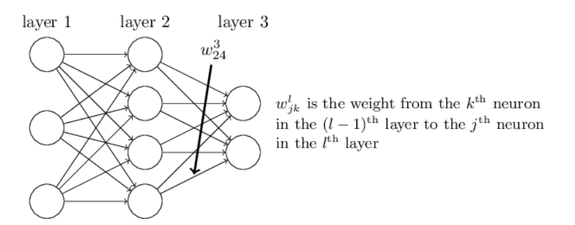
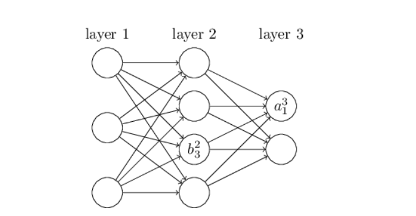
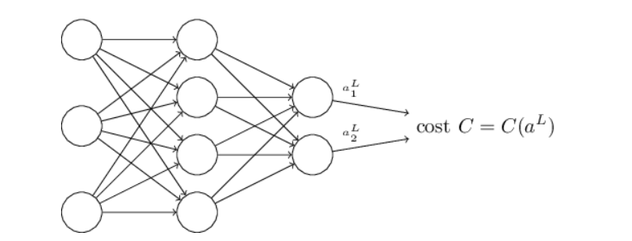
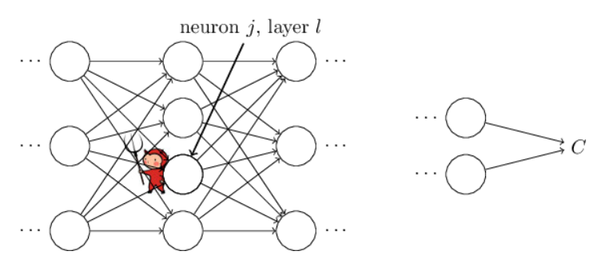
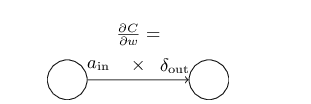
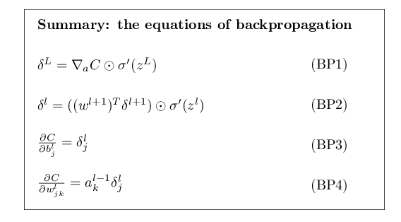

#### 目录
- [目录](#目录)
- [原文翻译](#原文翻译)
  - [第2章 反向传播算法的原理](#第2章-反向传播算法的原理)
  - [热身：一种基于矩阵的快速方法来计算神经网络的输出](#热身一种基于矩阵的快速方法来计算神经网络的输出)
  - [关于成本函数我们需要的两个假设](#关于成本函数我们需要的两个假设)
  - [Hadamard乘积，s⊙t](#hadamard乘积st)
  - [反向传播背后的四个基本方程](#反向传播背后的四个基本方程)
  - [问题](#问题)
  - [四个基本方程的证明(可选)](#四个基本方程的证明可选)
  - [反向传播算法](#反向传播算法)
  - [练习](#练习)
  - [反向传播代码](#反向传播代码)
  - [在什么意义上反向传播算法是一种快速算法？](#在什么意义上反向传播算法是一种快速算法)
  - [反向传播: 大图景](#反向传播-大图景)
- [注释说明](#注释说明)

#### 原文翻译
##### 第2章 反向传播算法的原理
 在上一章中，我们了解了神经网络如何使用梯度下降算法来学习其权重和偏差。然而，我们的解释存在一个空白：我们没有讨论如何计算成本函数的梯度。在本章中，我将解释一种用于计算此类梯度的快速算法，该算法称为反向传播。

 反向传播算法最初是在 20 世纪 70 年代引入的，但直到 David Rumelhart、Geoffrey Hinton 和 Ronald Williams 于 1986 年发表的一篇著名论文后，它的重要性才得到充分认识。该论文描述了几种神经网络，其中反向传播的工作速度远远快于早期的学习方法，使得使用神经网络解决以前无法解决的问题成为可能。如今，反向传播算法是神经网络学习的主力。

 本章比本书的其余部分涉及更多的数学知识。如果您对数学不感兴趣，您可能会想跳过本章，并将反向传播视为一个您愿意忽略其细节的黑匣子。为什么要花时间研究这些细节？

原因当然是想要更深入地理解。 反向传播的核心是成本函数 $C  $相对于网络中的任何权重 $ w $（或偏差 $ b $）的偏导数的表达式$∂C/∂w$。 这个表达式告诉我们，当我们改变权重和偏差时成本如何快速变化。 虽然这个表达式有些复杂，但它也具有美感，每个元素都有一个自然直观的解释。 因此，反向传播不仅仅是学习的快速算法。 它实际上为我们提供了如何改变权重和偏差如何改变网络整体行为的详细见解。 这值得详细研究。

话虽如此，如果您想浏览本章，或者直接跳到下一章，也可以。我写了本书的其余部分，即使您将反向传播视为黑匣子，也可以轻松阅读。当然，本书后面的一些要点我会回顾本章的结果。但在这些点上，即使您不遵循所有推理，您仍然应该能够理解主要结论。

##### 热身：一种基于矩阵的快速方法来计算神经网络的输出
在讨论反向传播之前，让我们先用基于矩阵的快速算法来热身一下，以计算神经网络的输出。实际上，我们在上一章快结束时已经简要地了解了该算法，但我描述得很快，因此值得重新详细讨论。特别是，这是在熟悉的上下文中熟悉反向传播中使用的符号的好方法。

让我们从一个符号开始，它让我们能够以明确的方式引用网络中的权重。我们将使用 $w^l_{jk}$ 表示从 $(l−1)^th $层中的 $k^{th}$ 神经元到$l^{th} $层中的 $j^{th}$ 神经元的连接权重。 例如，下图显示了从网络第二层中的第四个神经元到第三层中的第二个神经元的连接的权重：

这个符号表示起初可能有些繁琐，确实需要一些时间来掌握。但是，稍加努力，你会发现这种记号变得简单而自然。这种记号的一个特点是 $j $和 $k $指标的排序。你可能认为，使用 $j $指代输入神经元，而使用 $k$ 指代输出神经元更有意义，实际上却恰恰相反。我将在下面解释这种特殊情况的原因。

我们对网络的偏差和激活使用类似的符号。明确地，我们使用 $b^l_j$ 作为 $l^{th}$ 层中 $j^{th}$ 神经元的偏差。我们使用 $a^l_j$ 来激活 $l^{th}$ 层中的 $j^{th}$ 神经元。下图显示了这些符号的使用示例：

利用这些符号，第 \( l \) 层的第 \( j \) 个神经元的激活 \( a_j^l \) 通过下面的公式与 \( (l-1) \) 层的激活相关联（比较第4章节的方程式（4）和周围的讨论）
\[ a_j^l = \sigma \left( \sum_k w_{jk}^l a_k^{l-1} + b_j^l \right), \tag{23} \]
其中 \( \sigma \) 表示激活函数，\( w_{jk}^l \) 表示从第 \( (l-1) \) 层的第 \( k \) 个神经元到第 \( l \) 层的第 \( j \) 个神经元的权重，\( b_j^l \) 是第 \( l \) 层的第 \( j \) 个神经元的偏置。

其中的求和是对 \( (l-1) \) 层的所有神经元 \( k \) 进行的。为了将这个表达式重写为矩阵形式，我们为每一层定义一个**权重矩阵** \( w^l \)。权重矩阵 \( w^l \) 的条目就是连接到第 \( l \) 层神经元的权重，即第 \( j \) 行第 \( k \) 列的条目是 \( w_{jk}^l \)。同样地，对于每一层 \( l \)，我们定义一个**偏置向量** \( b^l \)。你可以猜到这是如何工作的——偏置向量的分量就是 \( b_j^l \)，每个分量对应 \( l \) 层的一个神经元。最后，我们定义一个激活向量 \( a^l \)，其分量是激活 \( a_j^l \)。

我们需要以矩阵形式重写 (23) 的最后一个要素是对诸如$ σ $之类的函数进行向量化的想法。我们在上一章中简要介绍了向量化，但回顾一下，其想法是我们希望将诸如$ σ $之类的函数应用于向量$ v $中的每个元素。我们使用明显的符号$ σ(v) $来表示函数的这种按元素应用。也就是说，$ σ(v)$ 的组成部分只是 $σ(v)j=σ(vj) $。举个例子，如果我们有函数 $f(x)=x^2 $那么 $f $的向量化形式就会产生效果
$$f\left(\begin{bmatrix} 2 \\ 3 \end{bmatrix}\right) = \begin{bmatrix} f(2) \\ f(3) \end{bmatrix} = \begin{bmatrix} 4 \\ 9 \end{bmatrix}, \tag{24}
$$
也就是说，矢量化的 $f$ 只是对矢量的每个元素进行平方。
考虑到这些符号，方程（23）可以重写为漂亮且紧凑的矢量化形式
$$a^l = \sigma(w^l a^{l-1} + b^l). \tag{25}
$$

这个表达式为我们提供了一种更全局的方式来思考一层中的激活与前一层中的激活如何相关：我们只需将权重矩阵应用于激活，然后添加偏差向量，最后应用$ σ$。这种全局视图通常比我们现在采用的逐个神经元视图更容易、更简洁（并且涉及更少的索引！）。将其视为逃离索引地狱的一种方式，同时保持对正在发生的事情的精确性。该表达式在实践中也很有用，因为大多数矩阵库都提供了实现矩阵乘法、向量加法和向量化的快速方法。事实上，上一章中的代码隐含地使用了这个表达式来计算网络的行为。

当使用方程（25）计算 $a^l$ 时，我们一路计算中间量 $z^l≡w^la^{l−1}+b^l$ 。事实证明，这个量非常有用，值得命名：我们将 $z^l$ 称为层$ l$ 中神经元的加权输入。我们将在本章后面大量使用加权输入 $z^l$ 。等式（25）有时根据加权输入写成 $a^l=σ(z^l) $。还值得注意的是， $z^l$ 具有组件$ z^l_j=∑_kw^l_{jk}a^{l−1}_k+b^l_j$ ，即 $z^l_j$ 只是神经元 $j$ 激活函数的加权输入在层 $l$ 中。

##### 关于成本函数我们需要的两个假设
反向传播的目标是计算成本函数$ C $相对于任何权重 $w$ 或偏差的偏导数 $∂C/∂w $和 $∂C/∂b$ 在网络中。为了使反向传播发挥作用，我们需要对成本函数的形式做出两个主要假设。不过，在陈述这些假设之前，记住一个成本函数示例是很有用的。我们将使用上一章中的二次成本函数（参见方程（6））。在最后一节的符号中，二次成本的形式为
$$C = \frac{1}{2n} \sum_x \left\| y(x) - a^L(x) \right\|^2, \tag{26}
$$
其中： $n$ 是训练样例总数；$1/2$是为了求导时方便消去常数项；总和是针对各个训练示例的 $x$； $y=y(x)$ 是对应的期望输出； $L $表示网络的层数； $a^L=a^L(x)$ 是输入 $x$ 时网络输出的激活向量。

好的，那么为了应用反向传播，我们需要对成本函数 $C$ 做出哪些假设？我们需要的第一个假设是，成本函数可以写为单个训练示例 $x $成本函数$ C_x $的平均值$ C=\frac{1}{n}∑_xC_x$ 。二次成本函数就是这种情况，其中单个训练示例的成本为 $C_x=\frac{1}{2}∥y−a^L∥^2$ 。这个假设也适用于我们将在本书中遇到的所有其他成本函数。

我们需要这个假设的原因是因为反向传播实际上让我们做的是计算单个训练示例的偏导数 $∂C_x/∂w$ 和 $∂C_x/∂b$ 。然后，我们通过对训练示例进行平均来恢复 $∂C/∂w$ 和 $∂C/∂b$ 。事实上，考虑到这个假设，我们假设训练示例 x 已被修复，并删除$ x $下标，将成本 $Cx $写为 $C $。我们最终会将 $x$ 放回去，但现在它是一个符号上的麻烦，最好保持隐式。

我们对成本做出的第二个假设是，它可以写成神经网络输出的函数：

例如，二次成本函数满足此要求，因为单个训练示例x的二次成本可以写成:
$$C = \frac{1}{2} \left\| y - a^L \right\|^2 = \frac{1}{2} \sum_j (y_j - a_j^L)^2, \tag{27}
$$
因此，它是输出激活的函数。当然，这个成本函数也依赖于期望的输出$y$，你可能会想为什么我们不把成本也看作是$y$的函数。但请记住，输入训练示例x是固定的，因此输出$y$也是一个固定的参数。特别地，我们无法通过改变权重和偏置来修改它，也就是说，这不是神经网络学习到的内容。因此，把$C$仅仅看作是输出激活$a^L$的函数是有道理的，而$y$仅仅是帮助定义这个函数的参数。

##### Hadamard乘积，s⊙t
反向传播算法基于常见的线性代数运算，比如向量加法、向量乘以矩阵等。但是其中一种运算较少见。特别地，假设$s$和$t$是两个相同维度的向量。我们使用$s⊙t$表示两个向量的元素乘积。因此，$s⊙t$的分量就是$(s⊙t)_j $= $s_jt_j$。举个例子，
$$\begin{bmatrix} 1 \\ 2 \end{bmatrix} \odot \begin{bmatrix} 3 \\ 4 \end{bmatrix} = \begin{bmatrix} 1 \times 3 \\ 2 \times 4 \end{bmatrix} = \begin{bmatrix} 3 \\ 8 \end{bmatrix}, \tag{28}
$$
这种逐元素乘法有时被称为Hadamard乘积或者Schur乘积。我们将其称为Hadamard乘积。良好的矩阵库通常提供Hadamard乘积的快速实现，在实现反向传播时非常方便。

##### 反向传播背后的四个基本方程
反向传播是关于理解如何改变网络中的权重和偏置会改变成本函数。最终，这意味着计算偏导数$∂C/∂w^l_{jk}$和$∂C/∂b^l_j$。但为了计算这些偏导数，我们首先引入一个中间量$δ^l_j$，我们称之为第$l$层中第$j$个神经元的误差。反向传播将提供一个计算误差$δ^l_j$的过程，然后将误差$δ^l_j$与$∂C/∂w^l_{jk}$和$∂C/∂b^l_j$联系起来。

为了理解误差是如何定义的，想象一下我们的神经网络中有一个恶魔：

恶魔坐在第 \( l \) 层的第 \( j \) 个神经元上。当输入到该神经元时，恶魔会干扰神经元的操作。它给神经元的加权输入添加了一个小的变化 \( \Delta z_j^l \)，使得神经元不是输出 \( \sigma(z_j^l) \)，而是输出 \( \sigma(z_j^l + \Delta z_j^l) \)。这一变化通过网络的后续层传播，最终导致总成本发生了 \( \frac{\partial C}{\partial z_j^l} \Delta z_j^l \) 的变化。

现在，这个恶魔是个好恶魔，它试图帮助你改善成本，即，它在试图找到一个使成本减小的 \( \Delta z_j^l \)。假设 \( \frac{\partial C}{\partial z_j^l} \) 的值很大（无论是正还是负）。那么恶魔可以通过选择 \( \Delta z_j^l \) 与 \( \frac{\partial C}{\partial z_j^l} \) 的符号相反，来大幅降低成本。相反，如果 \( \frac{\partial C}{\partial z_j^l} \) 接近零，那么恶魔几乎无法通过干扰加权输入 \( z_j^l \) 来改善成本。就恶魔而言，神经元已经非常接近最优了。因此，\( \frac{\partial C}{\partial z_j^l} \) 在某种意义上是神经元中错误的度量。

受这个故事的启发，我们定义第 \( l \) 层的第 \( j \) 个神经元的误差 \( \delta_j^l \) 为

\[ \delta_j^l \equiv \frac{\partial C}{\partial z_j^l}. \tag{29} \]

根据我们通常的约定，我们使用 \( \delta^l \) 来表示与层 \( l \) 相关的误差向量。反向传播将为我们提供一种计算每层的 \( \delta^l \) 的方法，然后将这些误差与实际感兴趣的量 \( \frac{\partial C}{\partial w_{jk}^l} \) 和 \( \frac{\partial C}{\partial b_j^l} \) 关联起来。

你可能会想，为什么恶魔要改变加权输入 \( z_j^l \)，似乎将恶魔想象为改变输出激活 \( a_j^l \) 更为自然，这样我们就会使用 \( \frac{\partial C}{\partial a_j^l} \) 作为误差的度量。实际上，如果你这样做，事情会按照下面的讨论相当顺利地解决。但这会使得反向传播的展示在代数上稍微复杂一些。因此，我们将坚持使用 \( \delta_j^l = \frac{\partial C}{\partial z_j^l} \) 作为我们的误差[1]度量。

**进攻计划**：反向传播围绕着四个基本方程展开。这些方程共同给出了计算误差$δ^l$和成本函数梯度的方法。我在下面陈述了这四个方程。但要注意：你不应该期望立即吸收这些方程。这样的期望会让你失望。事实上，反向传播方程非常丰富，要很好地理解它们需要相当多的时间和耐心，逐渐深入研究这些方程。好消息是，这样的耐心会得到多次回报。因此，本节讨论只是一个开始，帮助你逐步理解这些方程。

以下是我们将在本章后面更深入地研究这些方程的方式的预览：我将给出这些方程的简短证明，这有助于解释它们为什么成立；我们将以伪代码的形式重述这些方程，并看到伪代码如何被实现为真正的运行Python代码；在本章的最后一节中，我们将发展一个直观的图像，解释反向传播方程的含义，以及某人如何从零开始发现它们。在这个过程中，我们将一次又一次地回到这四个基本方程，随着你对方程的理解加深，这些方程将变得舒适，甚至可能变得美丽和自然。

**输出层的误差方程 \( \delta^L \)**：输出层的分量由下式给出：

\[ \delta_j^L = \frac{\partial C}{\partial a_j^L} \sigma'(z_j^L). \tag{BP1} \]

这是一个非常自然的表达式。右边的第一项 \( \frac{\partial C}{\partial a_j^L} \) 衡量成本函数随第 \( j \) 个输出激活的变化速度。例如，如果 \( C \) 对某个特定输出神经元 \( j \) 的依赖不大，那么 \( \delta_j^L \) 将会很小，这是我们所期望的。右边的第二项 \( \sigma'(z_j^L) \) 衡量激活函数 \( \sigma \) 在 \( z_j^L \) 处的变化速度。

注意，(BP1) 中的一切都容易计算。特别是，我们在计算网络行为时可以计算 \( z_j^L \)，计算 \( \sigma'(z_j^L) \) 只是稍微增加了一点额外的开销。\( \frac{\partial C}{\partial a_j^L} \) 的具体形式当然取决于成本函数的形式。然而，只要成本函数是已知的，计算 \( \frac{\partial C}{\partial a_j^L} \) 通常不会有困难。例如，如果我们使用的是二次成本函数 \( C = \frac{1}{2} \sum_j (y_j - a_j^L)^2 \)，那么 \( \frac{\partial C}{\partial a_j^L} = (a_j^L - y_j) \)，显然这是容易计算的。

方程(BP1)是 \( \delta^L \) 的分量表达式。这是一个完美的表达式，但并不是我们想要的用于反向传播的矩阵形式。然而，将方程重写为矩阵形式很简单，如下：

\[ \delta^L = \nabla_{a^L} C \odot \sigma'(z^L). \tag{BP1a} \]

这里，\( \nabla_{a^L} C \) 被定义为一个其分量是偏导数 \( \frac{\partial C}{\partial a_j^L} \) 的向量。你可以将 \( \nabla_{a^L} C \) 看作是 \( C \) 对输出激活的变化率。很容易看出方程(BP1a)和(BP1)是等价的，因此从现在起我们将交替使用(BP1)来指代这两个方程。例如，在二次成本函数的情况下，我们有 \( \nabla_{a^L} C = (a^L - y) \)，所以完全基于矩阵的(BP1)形式变为：

\[ \delta^L = (a^L - y) \odot \sigma'(z^L). \tag{30} \]

如你所见，这个表达式的每个部分都有一个很好的向量形式，可以使用如Numpy之类的库轻松计算。

**关于下一层误差 \( \delta^{l+1} \) 来定义误差 \( \delta^l \) 的方程**：具体来说，

\[ \delta^l = ((w^{l+1})^T \delta^{l+1}) \odot \sigma'(z^l), \tag{BP2} \]

其中 \( (w^{l+1})^T \) 是第 \( l+1 \) 层的权重矩阵 \( w^{l+1} \) 的转置。这个方程看起来复杂，但每个元素都有一个很好的解释。假设我们知道第 \( l+1 \) 层的误差 \( \delta^{l+1} \)。当我们应用转置权重矩阵 \( (w^{l+1})^T \)，我们可以直观地认为这是将误差向后通过网络传递，给我们提供了第 \( l \) 层输出的某种误差度量。然后我们取哈达玛德积 \( \sigma'(z^l) \)。这将误差通过激活函数在第 \( l \) 层向后移动，给我们在第 \( l \) 层的加权输入处的误差 \( \delta^l \)。

通过结合方程(BP2)与(BP1)，我们可以计算网络中任何层的误差 \( \delta^l \)。我们从使用(BP1)计算 \( \delta^L \) 开始，然后应用方程(BP2)来计算 \( \delta^{L-1} \)，再次使用(BP2)计算 \( \delta^{L-2} \)，依此类推，一直回到网络的开始。

**关于网络中任何偏置对成本变化率的方程**：具体来说：

\[ \frac{\partial C}{\partial b_j^l} = \delta_j^l. \tag{BP3} \]

即，误差 \( \delta_j^l \) 完全等于成本变化率 \( \frac{\partial C}{\partial b_j^l} \)。这是个好消息，因为(BP1)和(BP2)已经告诉我们如何计算 \( \delta_j^l \)。我们可以将(BP3)简写为：

\[ \frac{\partial C}{\partial b} = \delta, \tag{31} \]

其中假定 \( \delta \) 是在与偏置 \( b \) 相同的神经元上评估的。

**关于网络中任何权重对成本变化率的方程**：具体来说：

\[ \frac{\partial C}{\partial w_{jk}^l} = a_k^{l-1} \delta_j^l. \tag{BP4} \]

这告诉我们如何计算偏导数 \( \frac{\partial C}{\partial w_{jk}^l} \) 通过已知的量 \( \delta^l \) 和 \( a^{l-1} \)，我们已经知道如何计算。这个方程可以用一个不那么索引重的表示法重写为：

\[ \frac{\partial C}{\partial w} = a_{in} \delta_{out}, \tag{32} \]

这里假定 \( a_{in} \) 是连接到权重 \( w \) 的输入神经元的激活，而 \( \delta_{out} \) 是从该权重输出的神经元的误差。放大来看仅仅是权重 \( w \)，以及通过这个权重连接的两个神经元，我们可以这样描述：

方程(32)的一个好处是，当激活 \( a_{in} \) 很小，接近于 0 时，梯度项 \( \frac{\partial C}{\partial w} \) 也倾向于很小。在这种情况下，我们说权重学习得慢，意味着在梯度下降过程中它并没有太大的变化。换句话说，(BP4) 的一个结果是来自低激活神经元的权重学习得很慢。

还有其他洞见可从方程(BP1)-(BP4)获得。让我们从输出层开始看起。考虑(BP1)中的项 \( \sigma'(z_j^L) \)。回想上一章中关于sigmoid函数的图，当 \( \sigma(z_j^L) \) 大约为0或1时，函数变得非常平缓。这时，我们将得到 \( \sigma'(z_j^L) \approx 0 \)。所以，当输出神经元处于低激活（\( \approx 0 \)）或高激活（\( \approx 1 \)）时，最终层的一个权重学习会很慢。在这种情况下，通常说输出神经元已经**饱和**，因此，权重已经停止学习（或学习缓慢）。对输出神经元的偏置也适用类似的评论。

我们可以为较早的层获得类似的洞见。特别是注意(BP2)中的 \( \sigma'(z) \) 项。这意味着 \( \delta^j \) 可能变得很小，如果神经元接近饱和。这反过来意味着，输入到一个饱和神经元的权重将会很慢[2]地学习。

总结来说，我们已经学到，如果输入神经元是低激活的，或者输出神经元已经饱和（即，激活非常高或非常低），那么一个权重会很慢地学习。

这些观察并不太令人惊讶。然而，它们有助于改进我们对神经网络学习过程的认知模型。此外，我们可以将这种推理方式反过来运用。这四个基本方程原来适用于任何激活函数，而不仅仅是标准的 Sigmoid 函数（这是因为正如我们将在下一刻看到的那样，这些证明并不使用 $σ $的任何特殊性质）。因此，我们可以利用这些方程来设计具有特定期望学习特性的激活函数。举个例子来让你了解，假设我们选择一个（非 Sigmoid）激活函数$ σ$，以便 $σ'$ 总是为正，并且永远不接近零。这将防止普通 Sigmoid 神经元饱和时发生学习速度减慢的情况。本书后面会看到，这种修改已经应用于激活函数。铭记四个方程(BP1)-(BP4)回来可以解释为什么会尝试这样的修改以及它们可能带来的影响。

##### 问题
- **反向传播方程的另一种表述：** 我使用哈达玛积（Hadamard product）介绍了反向传播的方程（特别是\(BP1\)和\(BP2\)）。如果您不习惯哈达玛积，这种表述可能会让您感到困惑。这里有一种基于常规矩阵乘法的替代方法，一些读者可能会觉得更易于理解。
  1. 证明\(BP1\)可以重写为
   \[
   \delta^L = \Sigma'(z^L) \nabla_a C,
   \]
   其中\(\Sigma'(z^L)\)是一个方阵，其对角线上的元素为\(\sigma'(z_j^L)\)，非对角线元素为零。注意，这个矩阵通过常规矩阵乘法作用在\(\nabla_a C\)上。
  2. 证明\(BP2\)可以重写为
   \[
   \delta^L = \Sigma'(z^L)(w^{L+1})^T \delta^{L+1}.
   \]
  3. 结合观察(1)和(2)，展示
   \[
   \delta^L = \Sigma'(z^L)(w^{L+1})^T \cdots \Sigma'(z^{L-1})(w^L)^T \Sigma'(z^L) \nabla_a C.
   \]
对于熟悉矩阵乘法的读者来说，这种方程可能比\(BP1\)和\(BP2\)更容易理解。之所以关注\(BP1\)和\(BP2\)，是因为从数值实现的角度来看，这种方法更快。
##### 四个基本方程的证明(可选)
[http://neuralnetworksanddeeplearning.com/chap2.html#proof_of_the_four_fundamental_equations_(optional)]

##### 反向传播算法
反向传播方程为我们提供了计算成本函数梯度的方法。让我们明确地将其写成算法形式：

1. **输入 \(x\)：** 设置输入层的对应激活 \(a^1\)。
2. **前向传播：** 对于每个 \(l = 2, 3, \ldots, L\)，计算
   \[
   z^l = w^l a^{l-1} + b^l \quad \text{和} \quad a^l = \sigma(z^l).
   \]
3. **输出误差 \(\delta^L\)：** 计算向量 \(\delta^L = \nabla_a C \odot \sigma'(z^L)\)。
4. **误差反向传播：** 对于每个 \(l = L - 1, L - 2, \ldots, 2\)，计算
   \[
   \delta^l = ((w^{l+1})^T \delta^{l+1}) \odot \sigma'(z^l).
   \]
5. **输出：** 成本函数的梯度由下式给出
   \[
   \frac{\partial C}{\partial w^l_{jk}} = a^{l-1}_k \delta^l_j \quad \text{和} \quad \frac{\partial C}{\partial b^l_j} = \delta^l_j.
   \]

检查这个算法，您可以看到为什么它被称为“反向传播”。我们从最后一层开始向后计算误差向量 \(\delta^l\)。我们通过网络向后传播可能看起来有些奇怪，但如果您考虑到反向传播的证明，向后移动是成本函数是网络输出函数的后果。为了理解成本如何随早期的权重和偏置变化，我们需要重复应用链规则，通过层次向后工作以获得可用的表达式。

##### 练习
- **带有单个修改神经元的反向传播**
  假设我们在前馈网络中修改一个神经元，使得该神经元的输出由 \(f(\sum_j w_j x_j + b)\) 给出，其中 \(f\) 是除了sigmoid之外的某个函数。在这种情况下，我们应该如何修改反向传播算法？

- **带有线性神经元的反向传播**
  假设我们将网络中常用的非线性 \(\sigma\) 函数替换为 \(\sigma(z) = z\)。为这种情况重写反向传播算法。

正如我以上所描述，反向传播算法计算单个训练样本的成本函数梯度，即 \(C = C_x\)。实际上，通常将反向传播与学习算法（如随机梯度下降）结合使用，通过计算多个训练样本的梯度。特别是在给定一小批量 \(m\) 个训练样本的情况下，以下算法将基于这一小批量应用梯度下降学习步骤。

1. **输入一组训练样本**

2. **对于每一个训练样本 \(x\)：** 设置对应的输入激活 \(a^1\)，并执行以下步骤：
   - **前向传播：** 对于每个 \(l = 2, 3, \ldots, L\)，计算
     \[
     z^l = w^l a^{l-1} + b^l \quad \text{和} \quad a^l = \sigma(z^l).
     \]
   - **输出误差 \(\delta^L\)：** 计算向量
     \[
     \delta^L = \nabla_a C_x \odot \sigma'(z^L).
     \]
   - **误差反向传播：** 对于每个 \(l = L, L - 1, \ldots, 2\)，计算
     \[
     \delta^l = ((w^{l+1})^T \delta^{l+1}) \odot \sigma'(z^l).
     \]

3. **梯度下降：** 对于每个 \(l = L, L - 1, \ldots, 2\)，按以下规则更新权重
   \[
   w^l \rightarrow w^l - \eta \frac{1}{m} \sum_x \delta^l (a^{l-1})^T,
   \]
   并按以下规则更新偏置
   \[
   b^l \rightarrow b^l - \eta \frac{1}{m} \sum_x \delta^l.
   \]

当然，为了实际实现随机梯度下降，你还需要一个外部循环生成训练样本的小批量，以及一个外部循环多次遍历训练的多个周期。为了简单起见，我省略了这些循环。
##### 反向传播代码
[http://neuralnetworksanddeeplearning.com/chap2.html#the_code_for_backpropagation]

##### 在什么意义上反向传播算法是一种快速算法？
[http://neuralnetworksanddeeplearning.com/chap2.html#in_what_sense_is_backpropagation_a_fast_algorithm]

##### 反向传播: 大图景
[]

#### 注释说明
[1]在像MNIST这样的分类问题中，“误差”一词有时用来表示分类失败率。例如，如果神经网络正确分类了96.0％的数字，则误差为4.0％。显然，这与我们的δ向量有着完全不同的含义。在实践中，您不应该难以确定在任何给定的用法中使用的是哪个含义。
[2]这种推理在 \( (w^{l+1})^T \delta^{l+1} \) 有足够大的项来补偿 \( \sigma'(z_j^l) \) 的小值时不成立。但我所说的是一般趋势。*