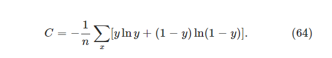

#### 原文翻译
##### 第3章 改进神经网络的学习方法
当高尔夫球手第一次学习打高尔夫球时，他们通常会花大部分时间来练习基本挥杆。他们只是逐渐地发展其他击球，学习削球、左曲球和小右曲球，建立和修改他们的基本挥杆动作。以类似的方式，到目前为止我们都专注于理解反向传播算法。这是我们的“基本摆动”，是大多数神经网络工作的学习基础。在本章中，我将解释一套技术，可用于改进反向传播的普通实现，从而改进我们的网络学习方式。

我们将在本章中开发的技术包括：更好地选择成本函数，称为交叉熵成本函数；四种所谓的“正则化”方法（L1 和 L2 正则化、dropout 和训练数据的人工扩展），使我们的网络能够更好地泛化训练数据之外的内容；一种更好的初始化网络权重的方法；以及一组启发式方法来帮助为网络选择良好的超参数。我还将不太深入地概述其他几种技术。这些讨论在很大程度上是相互独立的，因此如果您愿意，您可以跳到前面。我们还将在运行代码中实现许多技术，并使用它们来改进在第 1 章中研究的手写分类问题上获得的结果。

当然，我们只是介绍了为神经网络而开发的众多技术中的一小部分。我们的理念是，深入研究一些最重要的技术是获得众多可用技术的最佳途径。掌握这些重要的技术不仅本身很有用，而且还可以加深您对使用神经网络时可能出现的问题的理解。这将使您做好充分准备，以便在需要时快速掌握其他技术。

##### 交叉熵成本函数
我们大多数人都觉得犯错是不愉快的。开始学习钢琴后不久，我在观众面前进行了第一次表演。我很紧张，开始演奏这首曲子的八度太低了。我很困惑，无法继续，直到有人指出我的错误。我很尴尬。然而，尽管令人不快，但当我们犯了重大错误时，我们也会很快吸取教训。你可以打赌，下次我在观众面前演奏时，我演奏的是正确的八度！相比之下，当我们的错误不太明确时，我们学得会更慢。

理想情况下，我们希望并期望我们的神经网络能够从错误中快速学习。这在实践中会发生吗？为了回答这个问题，让我们看一个玩具示例。该示例涉及一个只有一个输入的神经元：

我们将训练这个神经元做一些非常简单的事情：将输入 1 发送到输出 0 。当然，这是一项微不足道的任务，我们可以轻松地手动计算出适当的权重和偏差，而无需使用学习算法。然而，事实证明，使用梯度下降来尝试学习权重和偏差是有启发性的。那么让我们看看神经元是如何学习的。

为了使事情变得明确，我将选择初始权重为 0.6 ，初始偏差为 0.9 。这些是用作开始学习的地方的通用选择，我并没有选择它们以任何方式特殊。神经元的初始输出是 0.82 ，因此在我们的神经元接近所需的输出 0.0 之前，需要进行大量学习。单击右下角的“运行”，查看神经元如何学习更接近 0.0 的输出。请注意，这不是预先录制的动画，您的浏览器实际上正在计算梯度，然后使用梯度来更新权重和偏差，并显示结果。学习率是 η=0.15 ，它足够慢，我们可以跟踪正在发生的事情，但也足够快，我们可以在短短几秒钟内获得实质性的学习。成本是二次成本函数 C ，在第 1 章中介绍过。我很快就会提醒您成本函数的确切形式，因此无需去挖掘定义。请注意，您可以通过再次单击“运行”来多次运行动画。

[动画还是要到原网站亲身感受一下的：http://neuralnetworksanddeeplearning.com/chap3.html]

正如您所看到的，神经元快速学习权重和偏差，从而降低成本，并给出神经元大约 0.09 的输出。这并不完全是所需的输出 0.0 ，但它非常好。然而，假设我们选择起始权重和起始偏差均为 2.0 。在这种情况下，初始输出是 0.98 ，这是非常错误的。让我们看看在这种情况下神经元是如何学习输出 0 的。再次点击“运行”：

尽管此示例使用相同的学习率 ( η=0.15 )，但我们可以看到学习开始的速度要慢得多。事实上，对于前 150 个左右的学习时期，权重和偏差根本没有太大变化。然后学习开始，就像我们的第一个例子一样，神经元的输出迅速接近 0.0 。

与人类学习相比，这种行为很奇怪。正如我在本节开头所说，当我们在某件事上犯了严重错误时，我们通常学得最快。但我们刚刚看到，当我们的人工神经元犯了严重错误时，学习会遇到很多困难——比仅仅犯了一点错误时要困难得多。更重要的是，事实证明这种行为不仅发生在这个玩具模型中，而且发生在更一般的网络中。为什么学习这么慢？我们能找到避免这种放缓的方法吗？

要理解问题的根源，请考虑我们的神经元通过以成本函数 ∂C/∂w 和 ∂C/∂b 的偏导数确定的速率改变权重和偏差来学习。所以说“学习很慢”实际上和说那些偏导数很小是一样的。挑战在于理解为什么它们很小。为了理解这一点，让我们计算偏导数。回想一下，我们使用的是二次成本函数，根据方程 (6)，该函数由下式给出：

其中 a 是使用训练输入 x=1 时神经元的输出， y=0 是相应的期望输出。为了更明确地用权重和偏差来写，请回想一下 a=σ(z) ，其中 z=wx+b 。使用链式法则对我们得到的权重和偏差进行微分

我替换了 x=1 和 y=0 。为了理解这些表达式的行为，让我们仔细看看右侧的 σ′(z) 术语。回想一下 σ 函数的形状：

从这张图中我们可以看到，当神经元的输出接近 1 时，曲线变得非常平坦，因此 σ′(z) 变得非常小。方程 (55) 和 (56) 告诉我们 ∂C/∂w 和 ∂C/∂b 变得非常小。这就是学习速度减慢的根源。更重要的是，正如我们稍后将看到的，在更一般的神经网络中，学习速度减慢的原因基本上相同，而不仅仅是我们一直在玩的玩具示例。

##### 引入交叉熵成本函数
我们如何解决学习速度放缓的问题？事实证明，我们可以通过用不同的成本函数（称为交叉熵）替换二次成本来解决问题。为了理解交叉熵，让我们稍微远离我们的超级简单的玩具模型。相反，我们假设我们正在尝试训练具有多个输入变量 $x_1,x_2,…$ 、相应权重$ w_1,w_2,…$ 和偏差$ b$ 的神经元：

神经元的输出当然是$ a = σ（z）$，其中 $z = ∑_j w_j x_j + b $是输入的加权和。我们通过定义跨熵成本函数来对这个神经元进行计算。

其中 n 是训练数据项的总数，总和是指所有训练输入 x，并且 y 是相应的期望输出。

表达式（57）解决学习减慢问题的效果并不明显。事实上，坦率地说，称其为成本函数是否有意义甚至都不明显！在解决学习速度减慢问题之前，让我们看看在什么意义上可以将交叉熵解释为成本函数。

特别是两个属性使得将交叉熵解释为成本函数变得合理。首先，它是非负的，即$ C>0 $。要看到这一点，请注意：（a）（57）中的总和中的所有单独项都是负数，因为两个对数都是 0 到 1 范围内的数字； (b) 总和前面有一个减号。

其次，如果神经元的实际输出接近所有训练输入的期望输出 $x $，则交叉熵将接近于零[1]。要看到这一点，假设 y=0 和 $a≈0$ 对于某些输入 $x $。这是神经元在该输入上做得很好的情况。我们看到成本表达式 (57) 中的第一项消失了，因为 $y=0$ ，而第二项只是 $−ln(1−a)≈0 $。当$ y=1$ 和$ a≈1$ 时，类似的分析也成立。因此，只要实际产量接近期望产量，对成本的贡献就会很低。

总而言之，交叉熵为正，并且随着神经元更好地计算所有训练输入 $x$ 的所需输出$ y$ ，交叉熵趋向于零。这些都是我们直观地期望成本函数具有的属性。事实上，二次成本也满足了这两个属性。所以这对于交叉熵来说是个好消息。但交叉熵成本函数的好处是，与二次成本不同，它避免了学习速度减慢的问题。为了了解这一点，我们来计算交叉熵成本相对于权重的偏导数。我们将$ a=σ(z)$ 代入(57)，并应用链式法则两次，得到：

将所有内容放在一个公分母上并简化就变成：

使用 sigmoid 函数的定义$ σ(z)=1/(1+e^{−z}) $和一点代数，我们可以证明$ σ^′(z)=σ(z)(1−σ(z)) $。我将要求您在下面的练习中验证这一点，但现在让我们接受给定的情况。我们看到上面的等式中的 $σ^′(z) $和 $σ(z)(1−σ(z))$ 项被取消，并且它简化为：

这是一个美丽的表达。它告诉我们权重学习的速率由 $σ(z)−y$ 控制，即由输出中的误差控制。误差越大，神经元学习的速度就越快。这正是我们直觉所期望的。特别是，它避免了由二次成本的类似方程（方程（55））中的 $σ^′(z)$ 项引起的学习速度减慢。当我们使用交叉熵时， $σ^′(z)$ 项被取消，我们不再需要担心它太小。这种抵消是交叉熵成本函数所保证的特殊奇迹。事实上，这并不是什么奇迹。正如我们稍后将看到的，交叉熵是专门选择具有此属性的。

以类似的方式，我们可以计算偏差的偏导数。我不会再详细介绍所有细节，但您可以轻松验证

同样，这避免了由二次成本的类似方程（方程（56））中的 $σ^′(z) $项引起的学习速度减慢。
##### 练习
* 验证 $σ^′(z)=σ(z)(1−σ(z))$ 。

让我们回到之前玩过的玩具示例，并探讨当我们使用交叉熵而不是二次成本时会发生什么。为了重新定位自己，我们将从二次成本表现良好的情况开始，起始权重 0.6 和起始偏差 0.9 。按“运行”看看当我们用交叉熵替换二次成本时会发生什么：

毫不奇怪，神经元在这种情况下学习得很好，就像之前一样。现在让我们看看我们的神经元之前被卡住的情况（链接，用于比较），权重和偏差都从 2.0 开始：

成功！这次神经元学得很快，正如我们所希望的那样。如果仔细观察，您会发现成本曲线的斜率最初比二次成本的相应曲线上的初始平坦区域陡得多。正是交叉熵为我们带来了这种陡度，防止我们在我们期望神经元学得最快时（即神经元一开始就严重错误时）陷入困境。

我没有说刚才举例中使用的学习率是多少。早些时候，对于二次成本，我们使用了 η=0.15 。我们应该在新示例中使用相同的学习率吗？事实上，随着成本函数的变化，不可能准确地说出使用“相同”学习率意味着什么；这是苹果和橙子的比较。对于这两个成本函数，我只是尝试找到一个学习率，以便能够了解正在发生的情况。如果您仍然好奇，尽管我否认，以下是内幕：我在刚刚给出的示例中使用了 η=0.005 。

您可能会反对，学习率的变化使上面的图表毫无意义。当我们一开始就任意选择学习率时，谁会关心神经元的学习速度有多快？这种反对意见没有抓住重点。图表的重点不在于学习的绝对速度。这是关于学习速度如何变化的。特别是，当我们使用二次成本时，当神经元明确错误时，学习速度会比之后更慢，因为神经元越来越接近正确的输出；而当神经元明确错误时，交叉熵学习速度会更快。这些陈述并不取决于学习率的设置方式。

我们一直在研究单个神经元的交叉熵。然而，很容易将交叉熵推广到多神经元多层网络。特别是，假设$ y=y_1,y_2,…$ 是输出神经元（即最后一层中的神经元）的期望值，而 $a^L_1,a^L_2,… $是实际输出值。然后我们定义交叉熵

这与我们之前的表达式公式 (57) 相同，只不过现在我们对所有输出神经元进行了 $∑_j$ 求和。我不会明确地进行推导，但使用表达式 (63) 可以避免多神经元网络中的学习速度减慢，这应该是合理的。如果你有兴趣，可以通过下面的问题进行推导。

顺便说一句，我使用“交叉熵”一词的方式让一些早期读者感到困惑，因为它表面上似乎与其他来源相冲突。特别是，通常将两个概率分布 $p_j$ 和 $q_j$ 的交叉熵定义为 $∑_jp_jlnq_j $。如果我们将单个 $S$ 型神经元视为输出由神经元的激活 $a$ 及其补 $1−a $组成的概率分布，则该定义可能与 (57) 相关。

然而，当最后一层有许多 sigmoid 神经元时，激活向量 $a^L_j$ 通常不会形成概率分布。因此，像$∑_jp_jlnq_j$ 这样的定义甚至没有意义，因为我们不处理概率分布。相反，您可以将 (63) 视为每个神经元交叉熵的总和，每个神经元的激活被解释为二元素概率分布的一部分[2]。从这个意义上说，（63）是概率分布交叉熵的推广。

我们什么时候应该使用交叉熵而不是二次成本？事实上，只要输出神经元是 S 形神经元，交叉熵几乎总是更好的选择。要了解原因，请考虑当我们设置网络时，我们通常使用某种随机化来初始化权重和偏差。这些初始选择可能会导致网络对于某些训练输入来说是绝对错误的 - 也就是说，输出神经元将在 1 附近饱和，而它应该是 0 ，或者反之亦然。如果我们使用二次成本会减慢学习速度。它不会完全停止学习，因为权重将继续从其他训练输入中学习，但这显然是不可取的。

##### 练习
* 交叉熵的一个问题是，一开始可能很难记住$ y$ 和 $a$ 各自的角色。人们很容易混淆正确的形式是$ −[ylna+(1−y)ln(1−a)] $还是$ −[alny+(1−a)ln(1−y)] $。当$ y=0 $或 $1$ 时，第二个表达式会发生什么？这个问题是否影响第一个表达式？为什么或者为什么不？
* 在本节开头的单神经元讨论中，我认为对于所有训练输入，如果 $σ(z)≈y$ ，交叉熵就很小。该参数依赖于 $y$ 等于 0 或 1 。这在分类问题中通常是正确的，但对于其他问题（例如回归问题），$ y$ 有时可以采用 0 和 1 之间的中间值。表明对于所有训练输入，当 $σ(z)=y $时，交叉熵仍然最小。在这种情况下，交叉熵的值为：

量$ −[ylny+(1−y)ln(1−y)] $有时被称为二元熵。

##### 问题
* 多层多神经元网络在上一章介绍的符号中，表明对于二次成本，输出层中权重的偏导数为

每当输出神经元在错误值上饱和时，术语 $σ^′(z^L_j)$ 就会导致学习速度减慢。表明对于交叉熵成本，单个训练示例$ x$ 的输出误差$ δ^L $由下式给出

使用此表达式可以表明相对于输出层中的权重的偏导数由下式给出

$σ^′(z^L_j)$ 项已经消失，因此交叉熵避免了学习速度减慢的问题，不仅在与我们之前看到的单个神经元一起使用时，而且在多层多神经元网络中也是如此。该分析的一个简单变化也适用于偏差。如果这对您来说并不明显，那么您也应该进行该分析。

当输出层中有线性神经元时使用二次成本假设我们有一个多层多神经元网络。假设最后一层的所有神经元都是线性神经元，这意味着不应用 sigmoid 激活函数，并且输出只是 $a^L_j=z^L_j $。表明如果我们使用二次成本函数，则单个训练示例 $x$ 的输出误差 $δ^L$ 由下式给出

与上一个问题类似，使用此表达式来表明输出层中权重和偏差的偏导数由下式给出

这表明，如果输出神经元是线性神经元，那么二次成本不会引起任何学习减慢的问题。在这种情况下，二次成本实际上是一个合适的成本函数。

##### 使用交叉熵对 MNIST 数字进行分类
[http://neuralnetworksanddeeplearning.com/chap3.html#using_the_cross-entropy_to_classify_mnist_digits]

##### 交叉熵是什么意思？它从何而来？
我们对交叉熵的讨论集中在代数分析和实际实现上。这很有用，但它留下了未解答的更广泛的概念性问题，例如：交叉熵意味着什么？有没有一些直观的方式来思考交叉熵？我们一开始是如何想象出交叉熵的呢？

让我们从最后一个问题开始：什么促使我们首先想到交叉熵？假设我们发现了前面描述的学习速度减慢，并且理解起源是方程（55）和（56）中的 $σ^′(z) $ 项。在仔细研究了这些方程之后，我们可能想知道是否可以选择一个成本函数来使  $σ^′(z) $ 项消失。在这种情况下，单个训练示例  $x  $的成本  $C=C_x  $将满足

如果我们可以选择成本函数来使这些方程成立，那么它们就会以一种简单的方式捕捉到这样的直觉：初始误差越大，神经元学习的速度越快。他们还将消除学习速度减慢的问题。事实上，从这些方程开始，我们现在将证明，只需遵循我们的数学嗅觉，就可以导出交叉熵的形式。要看到这一点，请注意，根据链式法则，我们有

使用 $σ^′(z)=σ(z)(1−σ(z))=a(1−a) $最后一个方程变为

与式(72)比较我们得到

将此表达式与 a 积分得出

对于一些积分常数。这是单个训练示例$ x $对成本的贡献。为了获得完整的成本函数，我们必须对训练示例进行平均，获得

其中这里的常数是每个训练示例的各个常数的平均值。因此我们看到方程（71）和（72）唯一地确定了交叉熵的形式，直至总体常数项。交叉熵并不是凭空奇迹般地产生的。相反，这是我们可以通过简单而自然的方式发现的东西。

交叉熵的直观意义又如何呢？我们应该如何思考呢？深入解释这一点会让我们比我想要的更进一步。然而，值得一提的是，有一种来自信息论领域的解释交叉熵的标准方法。粗略地说，这个想法是交叉熵是惊喜的衡量标准。特别是，我们的神经元正在尝试计算函数$ x→y=y(x)$ 。但它计算的是函数 $x→a=a(x) $。假设我们将 a 视为神经元的估计概率，即$ y $是 1 ，而$ 1−a $是正确值的估计概率$ y $是 0 。然后，交叉熵衡量当我们得知$ y$ 的真实值时，我们平均有多“惊讶”。如果输出符合我们的预期，我们会感到低惊讶；如果输出出乎意料，我们会感到高惊讶。当然，我还没有确切地说出“惊讶”是什么意思，所以这看起来可能是一句空话。但事实上，有一种精确的信息论方式来表达意外的含义。不幸的是，我不知道网上有关于这个主题的好的、简短的、独立的讨论。但如果您想深入挖掘，维基百科包含一个简短的摘要，可以帮助您走上正确的道路。详细信息可以通过研究$ Cover $和 $Thomas$ 所著的关于信息论的书第 5 章中有关卡夫不等式的材料来填写。

##### 问题
* 我们详细讨论了在使用二次成本进行训练的网络中，当输出神经元饱和时可能发生的学习减慢。另一个可能抑制学习的因素是等式（61）中 $x_j$ 项的存在。由于这个术语，当输入 $x_j$ 接近零时，相应的权重 $w_j$ 将学习缓慢。解释为什么不可能通过巧妙选择成本函数来消除$ x_j$ 项。

##### Softmax
在本章中，我们将主要使用交叉熵成本来解决学习速度减慢的问题。然而，我想简要描述解决该问题的另一种方法，该方法基于所谓的 softmax 神经元层。实际上，我们不会在本章的其余部分中使用 softmax 层，因此如果您很着急，可以跳到下一节。然而，softmax 仍然值得理解，部分原因是它本质上很有趣，部分原因是我们将在第 6 章深度神经网络的讨论中使用 softmax 层。

softmax 的想法是为我们的神经网络定义一种新型的输出层。它以与 sigmoid 层相同的方式开始，通过形成加权输入[3]$z^L_j=∑_kw^L_{jk}a^{L−1}_k+b^L_j$ 。但是，我们不应用 sigmoid 函数来获取输出。相反，在 softmax 层中，我们将所谓的 softmax 函数应用于 $z^L_j$ 。根据这个函数，第 j 个输出神经元的激活 $a^L_j$ 为

在分母中，我们对所有输出神经元求和。

如果您不熟悉 softmax 函数，方程 (78) 可能看起来相当不透明。我们为什么要使用这个函数当然不是很明显。而且这是否能帮助我们解决学习速度减慢的问题也并不明显。为了更好地理解方程 (78)，假设我们有一个具有四个输出神经元和四个相应的加权输入的网络，我们将其表示为 $z^L_1,z^L_2,z^L_3$ 和$ z^L_4$ 。下面显示的是可调节滑块，显示加权输入的可能值，以及相应输出激活的图表。开始探索的一个好地方是使用底部滑块来增加 $z^L_4 $：

……

##### 过拟合和正则化
##### Regularization 正则化
##### 为什么正则化有助于减少过度拟合？
##### 其他正则化技术
##### Weight initialization 权重初始化
##### 重新审视手写识别：代码
##### 如何选择神经网络的超参数？
##### Other techniques 其他技术
##### 随机梯度下降的变化
##### 其他人工神经元模型
##### 关于神经网络中的故事

#### 注释说明
[1]为了证明这一点，我需要假设所需的输出 y 都是 0 或 1 。例如，在解决分类问题或计算布尔函数时通常会出现这种情况。要了解当我们不做出此假设时会发生什么，请参阅本节末尾的练习
[2]当然，在我们的网络中不存在概率元素，因此它们并不是真正的概率。
[3]在描述 softmax 时，我们将频繁使用上一章中介绍的符号。如果您需要刷新有关符号含义的记忆，您可能希望重温该章。