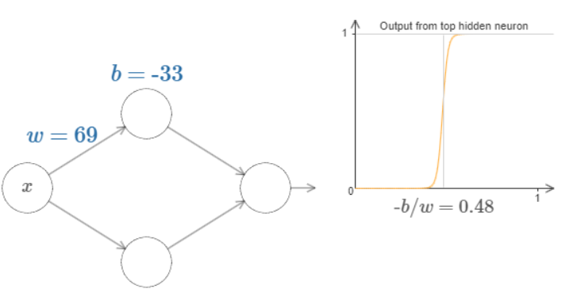
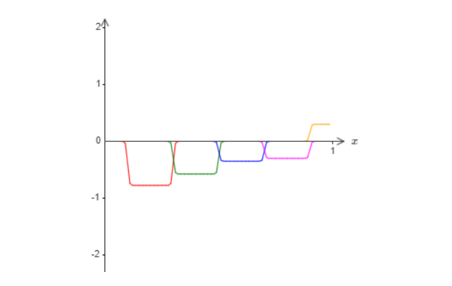

#### 目录
- [目录](#目录)
- [原文翻译](#原文翻译)
  - [第4章 用可视化方法证明神经网络可以计算任何函数](#第4章-用可视化方法证明神经网络可以计算任何函数)
  - [两个注意事项](#两个注意事项)
  - [只有一个输入和一个输出的普遍性定理](#只有一个输入和一个输出的普遍性定理)
  - [更多的输入变量](#更多的输入变量)
  - [问题](#问题)
  - [Sigmoid神经元之外的扩展](#sigmoid神经元之外的扩展)
  - [问题](#问题-1)
  - [修正阶跃函数](#修正阶跃函数)
  - [总结](#总结)
- [文章注解](#文章注解)
- [日积月累](#日积月累)
#### 原文翻译
##### 第4章 用可视化方法证明神经网络可以计算任何函数

关于神经网络最引人注目的事实之一就是它们可以计算任何函数。也就是说，假设有人给了你一些复杂的，扭曲的函数$f(x)$:

不管是什么函数都保证有一个神经网络对于每一个可能的输入$x$,都会从网络中得到一个输出值$f(x)$（或近似值）,例如：

即使这个函数有很多输入和输出，这个结果也仍然成立,$f(x)=f(x_1,x_2,...,x_m)$。例如，下面的神经网络计算的就是带有3个输入和2个输出的函数。

这个结果告诉我们神经网络具有一种普遍性。不管我们想要计算什么样的函数，我们都会想到有一个神经网络可以帮助我们计算出这个函数（或者说可以近似得到这个函数）。

更重要的是，即使我们限制我们的网络在输入和输出神经元之间只有一个中间层——一个所谓的单一隐藏层，这个普遍性定理仍然成立。因此，即使是非常简单的网络架构也可以非常强大。

普遍性定理为使用神经网络的人所熟知。但是为什么这却没有得到大众的广泛的理解。大多数的解释是相当技术性的。例如，George Cybenko (1989)的一篇原始论文证明了一个 S 函数的叠加逼近的结果。这个结果在当时是非常普遍的，而且几个小组证明了密切相关的结果[1]。Cybenko 的论文对这方面的大部分工作进行了有益的讨论。另一篇重要的早期论文是由 Kurt Hornik，Maxwell Stinchcombe 和 Halbert White (1989)提出的多层前馈网络是通用逼近器。本文利用 Stone-Weierstrass 定理得到了类似的结果。运用了哈恩-巴纳赫定理里斯表示定理和一些傅立叶变换家族中的关系。如果你是一个数学家，这个理论并不难理解，但是对于大多数人来说就不那么容易了。这是一个遗憾，因为普遍性的根本原因是简单而美丽的。

在这一章中，我给出了普遍性定理的一个简单而直观的解释。我们将一步一步地通过基本的想法。你会明白为什么神经网络可以计算任何函数。您将理解这个结果的一些局限性。你就会明白这个结果与深层神经网络之间的关系。

为了跟随本章的内容，你不需要阅读本书的前几章。相反，这一章的结构是一个独立的文章享受。只要你对神经网络有一点点基本的了解，你就应该能够理解这个解释。不过，我会偶尔提供早期材料的链接，以帮助填补您的知识空白。

普遍性定理在计算机科学中是司空见惯的，以至于我们有时会忘记它们是多么惊人。但是值得提醒自己的是: 计算任意函数的能力确实非凡。几乎你能想象到的任何过程都可以被认为是函数计算。思考一下根据一小段音乐样本来命名一段音乐的问题就可以认为是计算一个函数。或者考虑一下把中文文本翻译成英文的问题，同样，这可以被认为是计算一个函数[2]。或者考虑一下使用 mp4电影文件并生成对电影情节的描述以及对表演质量的讨论，这可以被看作是一种函数计算[3]。普遍性意味着,原则上，神经网络可以做所有这些事情和更多的事情。

当然，仅仅因为我们知道存在一个神经网络可以将中文文本翻译成英文，并不意味着我们有很好的技术来构建甚至识别这样一个网络。这种局限性也适用于布尔电路等模型的传统普适性定理。但是，正如我们在前面的书中看到的，神经网络有强大的学习功能算法。这种学习算法 + 通用性的组合是一种有吸引力的组合。到目前为止，这本书的重点是学习算法。在本章中，我们将重点讨论普遍性及其意义。

##### 两个注意事项
在解释为什么普遍性定理是正确的之前，我想提到两个非正式陈述“神经网络可以计算任何函数”的注意事项。

首先，这并不意味着网络可以用来精确地计算任何函数。相反，我们可以得到一个尽可能好的近似值。通过增加隐藏神经元的数量，我们可以提高近似值。例如，前面我举了一个用三个隐藏的神经元的网络计算函数 $f(x)$的例子。对于大多数函数来说，只有使用三个隐藏的神经元才能得到低质量的近似值。通过增加隐藏神经元的数量(比如说，增加到5个) ，我们通常可以得到一个更好的近似值:

通过进一步增加隐藏神经元的数量，我们可以做得更好。

为了使这个陈述更精确，假设我们给出了一个函数$f(x)$我们希望能够在一定的精度范围内计算 ε > 0。通过使用足够的隐藏神经元，我们总是可以找到一个神经网络的输出$g(x)$满足$|g(x)-f(x)|< ε$,对于所有的输入$x$。换句话说，对于每一种可能的输入，这种近似将在预期的精度范围内。

第二个注意事项是，这一类需要近似得到的函数必须是连续函数。如果一个函数是不连续的，例如，跳跃函数，那么通常不可能用神经网络来近似。这并不奇怪，因为我们的神经网络计算的就是输入的连续函数。然而，即使我们真正想要计算的函数是不连续的，通常情况下，连续的近似其实也足够好了。如果是这样的话，我们就可以用神经网络来近似了。在实践中，这通常不是一个重要的限制。总而言之，对于普遍性定理的一个更精确的描述是，具有单个隐层的神经网络可以用来逼近任意连续函数，达到任意期望的精度。在本章中，我们实际上将证明这个结果的一个稍微弱一点的版本，使用两个隐藏层而不是一个。在这些问题中，我将简要地概述如何通过一些调整，使解释适合于给出一个只使用一个隐藏层的证明。

##### 只有一个输入和一个输出的普遍性定理
为了理解普适性定理为什么成立，让我们从构建一个能近似得到一个函数的只有一个输入和一个输出的神经网络开始：

这就是普遍性问题的核心。一旦我们理解了这个特殊情况，实际上就很容易扩展到具有多个输入和多个输出的函数。

为了深入理解如何构建一个计算$f(x)$的网络，让我们从一个仅包含一个隐藏层、两个隐藏神经元和一个输出层包含一个输出神经元的网络开始：

为了了解网络中的组件是如何工作的，让我们把注意力集中在顶部隐藏的神经元上。在下图中，单击权重$w$，并拖动鼠标向右一点的方式来改变$w$值。你可以立即看到顶部隐藏神经元计算出的函数是如何变化的:（这里必须强烈推荐到原网站体验可视化操作界面，真的非常nice！http://neuralnetworksanddeeplearning.com/chap4.html#basic_network_precursor）

正如我们在前面学过的，被隐藏的神经元计算的是$ σ (wx + b) $[https://neuralnetworksanddeeplearning.com/chap1.html#sigmoid_neurons]，其中$ σ (z)≡\frac{1}{(1 + e^{-z})}$是sigmoid 函数。到目前为止，我们已经频繁地使用这种代数形式。但是为了证明普遍性，我们将完全忽略代数，而是操纵和观察图中所显示的形状，从而获得更多的见解。这不仅能让我们更好地了解正在发生的事情，还能证明[4]激活函数的普适性还适用于sigmoid函数以外的其他函数。

要开始进行这个证明，请尝试点击偏移值b(bias)，并向右拖动以增加它。你会看到，随着偏差的增加，图像会向左移动，但它的形状不会改变。

接下来，单击并向左拖动，以减少bias。你会看到，随着偏差的减小，图像会向右移动，但是，同样的，它的形状不会改变。

接下来，将权重w减少到2或3.你会看到，当你减小w时，曲线会变宽。您可能还需要改变b，以便将曲线保持在图像界面内。

最后，将重量增加到 w = 100以上.当你这样做时，曲线变得更陡，直到最后它看起来像一个阶跃函数。尝试调整偏置，使步长发生在 x = 0.3附近.下面的短片显示了您的结果应该是什么样子。点击播放按钮播放(或重播)视频:http://neuralnetworksanddeeplearning.com/chap4.html#basic_network_precursor

我们可以通过大幅度增加权重来简化分析，使得输出实际上是一个阶跃函数，达到一个非常好的近似值。下面我绘制了顶部隐藏神经元权重为 w = 999时的输出。请注意，此图是静态的，您不能更改参数，如权重。

实际上，使用阶跃函数比使用一般的Sigmoid函数要容易得多。原因在于在输出层我们需要将所有隐藏神经元的贡献相加。分析一堆阶跃函数的总和很容易，但当你把一堆Sigmoid形状的曲线加在一起时，推理起来就更加困难。因此，假设我们的隐藏神经元输出的是阶跃函数，会让事情变得更容易。更具体地说，我们通过将权重w固定为一个非常大的值来做到这一点，然后通过修改偏置来设置阶跃的位置。当然，把输出视为阶跃函数是一种近似，但这是一个非常好的近似，现在我们将把它当作准确的。我稍后会回来讨论这种近似的偏差对结果的影响。

在 x 的哪个值处会发生跃变？换个方式说，跃变的位置如何取决于权重和偏置？

要回答这个问题，请尝试修改上面图表中的权重和偏置（您可能需要稍微向后滚动）。您能想出阶跃位置与 w 和 b 有关的方式吗？通过一点努力，您应该能够说服自己，步骤的位置与 b 成比例，与 w 成反比。

实际上，这一步骤在位置$s =  -\frac{b}{w} $，您可以看到通过修改以下图表中的权重和偏差：（动手实践一下很直观的感受到s与b成正比，与w成反比。）

使用单个参数s来描述隐藏神经元将极大地简化我们的生活，该参数为步距$s =  -\frac{b}{w} $。尝试修改下图中的s，以适应新的参数化：

如上所述，我们已经隐式地将输入的权重 w 设置为某个较大的值——足够大，使阶跃函数成为一个很好的近似。我们可以很容易地将以这种方式参数化的神经元转换回常规模型，方法是选择偏置$ b = -ws$。

到目前为止，我们一直关注的是仅仅从顶部隐藏神经元输出。（实际上使用一个神经元的神经网络还可以简化为下图：）

现在让我们看看整个网络的行为。特别是，我们将假设隐藏神经元正在计算由阶梯点$s_1$（顶部神经元）和$ s_2$（底部神经元）参数化的阶梯函数。它们将有各自的输出权重$w_1$和$w_2$。这是网络:

右侧绘制的是隐藏层的加权求和输出$w_1a_1+w_2a_2$。在这里，$a_1$和$a_2$分别[5]为顶部和底部隐藏神经元的输出。这些输出被标记为 a，因为它们通常被称为神经元的激活。

尝试增加和减少顶部隐藏神经元的步距 $s_1$。感受一下这如何改变隐藏层的加权输出。特别值得理解的是，当 $s_1$ 超过 $s_2$ 时会发生什么。您会发现当这种情况发生时，图形的形状会发生变化，因为我们已经从顶部隐藏神经元首先被激活的情况转变为底部隐藏神经元首先被激活的情况。

同样，尝试操纵底层隐藏神经元的步点$s_2$，并感受这如何改变隐藏神经元的联合输出。

尝试增加和减小每个输出权重。注意这如何重新缩放来自相应隐藏神经元的贡献。当其中一个权重为零时会发生什么？

最后，尝试将$w_1$设置为0.8，将$w_2$设置为-0.8。您将得到一个“突起”函数，其起点为$s_1$，终点为$s_2$，高度为0.8。例如，加权输出可能如下所示：

当然，我们可以重新调凸起到任意高度。让我们使用一个单一参数$h$，来表示高度。为了减少混乱，我还会去掉“$s_1 = …$”和“$w_1 = …$”的符号。

尝试更改h的值上下移动，看看凸起的高度如何改变。 尝试将高度更改为负值，并观察会发生什么。 尝试更改步点，看看这如何改变凸起的形状。

顺便提一下，您会注意到，我们使用神经元的方式不仅可以以图形方式来理解，还可以以更传统的编程方式来理解，比如一种if-then-else语句：

    if input >= step point:
        add 1 to the weighted output
    else:
        add 0 to the weighted output

在大多数情况下，我将坚持图形的观点。但在接下来的内容中，有时您可能会发现切换观点并考虑事物的 if-then-else 方式会有所帮助。

我们可以使用我们的凸起制作技巧，将两对隐藏神经元粘合在同一个网络中，从而获得两个凸起:

我已经压制了这里的权重，只是为每对隐藏神经元编写 h 值。尝试增加和减少两个 h 值，并观察它如何改变图形。通过更改步点来移动突起。

更一般地，我们可以使用这个想法来获得任意高度的许多峰值。特别是，我们可以将区间[0,1]分成大量N个子区间，并使用N对隐藏神经元来设置任意所需高度的峰值。让我们看看对于N = 5时如何运作。 这是相当多的神经元，所以我要稍微压缩一下。对于图表的复杂性表示歉意：我可以通过进一步概括来隐藏复杂性，但我认为应该忍受一点复杂性，以更具体地了解这些网络是如何工作的。

您可以看到隐藏神经元中有五对。各对神经元的阶梯点为0，1/5，然后是1/5，2/5，以此类推，直到4/5，5/5。这些值是固定的,它们确保我们在图表上得到五个均匀间隔的隆起。

每对神经元都有一个与之相关的值h。请记住，从神经元输出的连接具有权重h和−h（未标记）。点击其中一个h值，然后拖动鼠标向右或向左改变值。当您这样做时，观察函数的变化。通过改变输出权重，我们实际上正在设计函数！

相反，尝试单击图形，然后上下拖动以更改任何凸函数的高度。当您更改高度时，您可以看到相应的 h 值的变化。虽然没有显示，但对应的输出权重也会发生变化，分别为 +h 和 -h。

换句话说，我们可以直接操纵出现在右侧图表中的函数，并看到在左侧的 h 值中反映出来。一个有趣的事情是按住鼠标按钮并将鼠标从图表的一侧拖到另一侧。当您这样做时，您会绘制出一个函数，并观察神经网络中的参数如何适应。

是时候迎接挑战了。

让我们想想我在本章开头绘制的函数:

我当时没有说，但我绘制的实际上是这个函数:
$$f(x)=0.2+0.4x^2+0.3xsin(15x)+0.05cos(50x),(113)$$
由0绘制到1，y轴的取值范围为0到1。

这显然不是一个简单的函数。

您将学会如何使用神经网络来计算它。

在我们上面的网络中，我们一直在分析加权组合$∑_jw_ja_j$从隐藏神经元的输出。我们现在知道如何对这个数量获得很大的控制。但是，正如我之前所指出的，这个数量不是网络输出的结果。从网络输出的是$σ(∑_jw_ja_j+b)$，其中b是输出神经元上的偏置。我们是否有办法控制网络实际输出的结果？

解决方案是设计一个神经网络，其隐藏层的加权输出由$ σ^{-1}∘f(x)$ 给出，其中$σ^{-1}$只是σ函数的倒数。也就是说，我们希望从隐藏层的加权输出为：

如果我们能做到这一点，那么整个网络的输出将会很好地逼近$f(x)$[6]。

那么，你的挑战就是设计一个神经网络来近似上面所示的目标函数。为了尽可能多地学习，我要你把这道题解两次。第一次，请点击图表，直接调整不同凸点的高度功能。你应该会发现很容易找到与目标函数很好的匹配。你做得如何是通过目标函数和网络实际计算的函数之间的平均偏差来衡量的。你的挑战是尽可能地降低平均偏差。当平均偏差达到0.40或以下时，你就完成了挑战。

一旦你这样做了，点击“重置”随机重新初始化凸起。第二次解决这个问题时，要克制住点击图表的冲动。相反，修改 h数值在左手边，并再次尝试驱动平均偏差为0.40或以下。

目前平均误差大于0.64，继续调整。

现在已经算出了网络近似计算函数$f (x)$所需的所有元素$f(x)$！这只是一个粗略的近似值，但我们可以很容易地做得更好，只要增加隐藏的神经元对的数量，允许更多的凸起。

事实上，很容易将我们找到的所有数据转换回用于神经网络的标准参数化。让我快速回顾一下它是如何运作的。

第一层的权值都有一些较大的常数值，比如$ w = 1000$。

对隐藏层的神经元的偏置值是$b=-ws$。 因此，例如，对于第二个隐藏层的神经元$s=0.2$变成$b=−1000×0.2=−200。$

最后一层权重由$h$值决定。因此，例如，您在上面为第一个$h$选择的值$h=-1.2$，意味着前两个隐藏神经元的输出权重分别为$-1.2$和$1.2$,对于整个输出权重层都是同理。

最后，输出神经元的偏差为0。

这就是整个过程: 我们现在有一个神经网络的完整描述，它能很好地计算我们原来的目标函数。我们知道如何通过增加隐神经元的数量来提高近似的质量。

而且，我们最初的目标函数也没有什么特别,$f(x)=0.2+0.4x^2+0.3xsin(15x)+0.05cos(50x)$。

我们可以将此过程用于从[0,1]到[0,1]的任何连续函数。 本质上，我们正在使用单层神经网络来构建函数的查找表。 我们将能够在这个想法的基础上再接再厉，提供普遍性的一般证明。

##### 更多的输入变量
让我们将结果扩展到许多输入变量的情况。这听起来很复杂，但只要两个输入，我们需要的所有想法都可以理解。因此，让我们解决两个输入的案例。

我们将首先考虑当我们对神经元有两个输入时会发生什么：

在这里，我们有输入$x$和$y$，具有相应的权重$w_1$和$w_2$，以及神经元上的偏置$b$。 让我们把权重$w_2$设置为$0$，然后调节第一个权重，$w_1$，以及偏差$b$，看看它们如何影响神经元的输出：

如您所见，在$w_2=0$的情况下，输入$y$与神经元的输出没有区别。就好像$x$是唯一的输入。

鉴于这一点，如果我们将权重$w_1$增加到$w_1=100$，而$w_2$保持为 0，你认为会发生什么？如果你不立即看到答案，请思考一下这个问题，看看能否搞清楚发生了什么。然后尝试一下，看看你是否正确。我在下面的视频中展示了发生了什么。

正如我们之前讨论的那样，随着输入权重增大，输出逼近阶跃函数。不同的是现在阶跃函数在三维中。与之前一样，我们可以通过修改偏置来移动阶跃点的位置。阶跃点的实际位置为$s_x = - b / w_1$。

让我们重做上述内容，使用阶跃的位置作为参数：

在这里，我们假设 x 输入上的权重值很大,$w_1 = 1000$和权重$w_2 = 0$。 神经元上的数字是步点，数字上的小 x 提醒我们，步骤是在 x 方向。当然，我们也可以通过使 y 输入上的权重非常大（比如，$w_2 = 1000$）并且 x 输入上的权重等于0，即$w_1 = 0$，来获得 y 方向上的阶跃函数。

神经元上的数字再次表示距离点，而在这种情况下，数字上面的小y提醒我们步骤是在y方向上。我本可以明确地标记x和y输入上的权重，但我决定不这样做，因为这样会使图表显得混乱。但请记住，小y标记隐含地告诉我们y权重很大，x权重为0。

我们可以使用我们刚刚构建的阶跃函数来计算一个三维凸起函数。为此，我们使用两个神经元，每个计算 x 方向上的阶跃函数。然后，我们分别使用权重 h 和 -h 将这些阶跃函数结合起来，其中 h 是凸起的期望高度。这一切都在下面的图示中说明：

尝试更改高度值h。观察它与网络中的权重的关系。看看它如何改变右侧的隆起函数的高度。

另外，尝试将阶跃点修改为 0.30，与顶部隐藏神经元相关联。观察它如何改变突起的形状。当您将其移动到与底部隐藏神经元相关联的步骤点 0.70 之后会发生什么？

我们已经找到了如何在 x 方向制作一个凸函数。当然，我们可以通过在 y 方向使用两个阶跃函数轻松地制作一个凸函数。请记住，我们通过对 y 输入设定大的权重，对 x 输入设定0权重来完成此操作。这是结果：

这几乎和之前的网络一模一样！ 唯一明显变化的是，现在在我们的隐藏神经元上有一些小 y 标记。 这提醒我们，它们产生的是 y 阶跃函数，而不是 x 阶跃函数，因此权重在 y 输入上非常大，并且在 x 输入上为零，而不是相反。 与之前一样，我决定不明确显示这一点，以避免混乱。

让我们考虑一下当我们将两个隆起函数相加时会发生什么，一个在x方向，另一个在y方向，高度都为h：

为了简化图表，我删除了权重为零的连接。目前，我在隐藏神经元中保留了小的 x 和 y 标记，提醒您正在计算凸函数的方向。稍后我们甚至会删除这些标记，因为它们被输入变量隐含。

尝试变化参数h。正如您所看到的，这会导致输出权重改变，以及x和y两个凸函数的高度。

我们构建的东西看起来有点像一个塔函数：

如果我们可以构建这样的塔函数，那么我们可以通过添加许多不同高度和不同位置的塔来逼近任意函数：

当然，我们还没有想出如何建造塔函数。我们构建的看起来像一个中央塔，高度为2h，周围有一个高度为h的平台。

但我们可以制作一个塔函数。请记住，我们之前看到神经元可以用来实现一种if-then-else语句：

    if input >= threshold: 
        output 1
    else:
        output 0

这仅针对具有单个输入的神经元。我们想要的是将类似的思想应用于隐藏神经元的组合输出：

    if combined output from hidden neurons >= threshold:
        output 1
    else:
        output 0

如果我们选择合适的阈值,比如说，一个介于高原高度和中央塔高度之间的值为$\frac{3h}{2}$,我们可以将高原挤压到零，并只留下中央塔。

你能看清楚如何做到这一点吗? 尝试用以下网络进行实验以弄清楚。请注意，我们现在绘制整个网络的输出，而不仅仅是来自隐藏层的加权输出。这意味着我们向来自隐藏层的加权输出添加偏差项，并应用 sigma 函数。你能找到产生一个塔的 h 和 b 的值吗? 这有点棘手，所以如果你考虑了一会儿还卡住了，这里有两个提示：
(1) 为了使输出神经元显示正确的 if-then-else 行为，我们需要输入权重（全部都是 h 或 -h）很大;
(2) b 的值决定了 if-then-else 阈值的尺度。

使用我们的初始参数，输出看起来像是早期图表的平坦版本，其中包含其塔和高原。为了获得期望的行为，我们增加参数 h 直到它变大。这样就会产生 if-then-else 的阈值行为。其次，为了正确设置阈值，我们将选择 b ≈ - 3 h / 2。尝试一下，看看效果如何！

这是当我们使用 h = 10 时的样子。

即使对于这个相对较小的 h 的值，我们获得一个相当不错的塔函数。当然，通过进一步增加 h，并保持偏差为 b = -3h/2，我们可以使其越来越好。

让我们尝试将两个这样的网络结合在一起，以计算两个不同的塔函数。为了清晰地说明两个子网络的各自角色，我把它们放在下面的不同框中：每个框使用上面描述的技术计算一个塔函数。右侧的图显示了来自第二隐藏层的加权输出，也就是塔函数的加权组合。

特别是，您可以看到，通过修改最后一层中的权重，您可以更改输出塔的高度。

相同的思想可以用来计算我们想要的任意数量的塔。我们还可以使它们尽可能细，以及任何我们想要的高度。因此，我们可以确保第二个隐藏层的加权输出逼近任意两个变量的所需函数：

特别是，通过使第二个隐藏层的加权输出成为$σ^{- 1} ∘ f$的良好近似，我们确保网络的输出将是任何期望的函数$f$的良好近似。

多于两个变量的函数怎么样？

让我们尝试三个变量$ x_1、x_2、x_3$。 以下网络可用于在四维空间中计算塔函数：

这里，$x_1、x_2、x_3$表示网络的输入。$s_1、t_1$等是神经元的阶梯点——即，第一层中的所有权重都很大，并且偏置设置为给出阶梯点$s_1、t_1、s_2$等。第二层中的权重交替+ h，- h，其中 h 是一个很大的数。 输出偏置为$-5h / 2$。

只要满足三个条件，这个网络计算一个函数：$x_1 $在 $s_1$ 和$ t_1$ 之间；$x_2$ 在 $s_2$ 和 $t_2$ 之间；$x_3$ 在 $s_3$ 和 $t_3$ 之间。在其他地方，这个网络是0。也就是说，它是一种在输入空间的一个小区域内为1，在其他地方为0的塔。

通过将许多这样的网络粘合在一起，我们可以得到尽可能多的塔，从而近似处理三个变量的任意函数。在 m 维空间中也同样适用。 唯一需要改变的是要使输出偏置 $( -m + 1 / 2 )$ ，以便获得正确的夹层以平整高原。

好的，那么现在我们知道如何使用神经网络来近似多变量的实值函数。那么向量值函数$ f(x_1, ..., x_m) ∈ R^n $呢？当然，这样的函数可以被视为只是 n 个单独的实值函数，$f^1(x_1, ..., x_m)$，$f^2(x_1, ..., x_m)$，等等。因此，我们创建一个近似$f^1$的网络，另一个网络用于$f^2$，依此类推。然后我们简单地将所有网络粘合在一起。这样也很容易处理。

##### 问题
我们已经看到如何使用具有两个隐藏层的网络来逼近任意函数。您能找到证明显示只使用单个隐藏层也是可能的吗？提示：尝试在仅有两个输入变量的情况下工作，并显示：(a) 不仅可以获得阶跃函数，而且可以沿任意方向获得； (b) 通过累加部分 (a) 中的许多构造，可以逼近圆形而不是矩形的塔函数； (c) 使用这些圆形塔，可以逼近任意函数。要做到 (c) ，可能需要借助本章稍后的一些想法。

##### Sigmoid神经元之外的扩展
我们已经证明，由Sigmoid神经元组成的网络可以计算任何函数。 回想一下，在乙状神经元中，输入$x_1,x_2,...$导致输出$σ(∑_jw_jx_j+b)$，其中$w_j$是权重，b是偏置，σ是乙状函数：

如果我们考虑一种不同类型的神经元，一个使用其他激活功能的神经元，$s（z）$：

[这明显比s形函数复杂很多，这么一对比发现，Sigmoid之所以广泛应用的原因在于通过变形其能近似很多意想不到的函数。]
也就是说，我们将假设如果我们的神经元有输入$x_1，x_2，...$，权重$w_1，w_2$，...和偏置b，那么输出是$s（∑_jw_jx_j+b）$。

我们可以使用此激活函数来获得阶跃函数，就像我们对sigmoid所做的那样。尝试在以下内容中增加重量，比如说w=100：

就像sigmoid一样，这会导致激活函数收缩，并最终成为阶跃函数的一个很好的近似值。尝试改变偏见，你会看到我们可以将步骤的位置设置为我们选择的任何地方。因此，我们可以使用与以前相同的技巧来计算任何所需的函数。

$S(z)$需要满足哪些属性才能发挥作用？我们确实需要假设$s(z)$被很好地定义为$z→−∞$和$z→∞$。这两个限制是我们步骤函数所采用的两个值。我们还需要假设这些限制彼此不同。如果他们不是，就不会有步骤，只是一个平面图！但只要激活函数$s（z）$满足这些属性，基于这种激活函数的神经元是通用的计算。

##### 问题
* 在书的前面，我们遇到了另一种被称为整换线性单位的神经元。解释为什么这些神经元不能满足刚刚给出的普遍性条件。找到一个普遍性的证明，证明整线性单位是计算通用的。

* 假设我们考虑线性神经元，即具有激活函数s(z)=z的神经元。解释为什么线性神经元不能满足刚刚给出的普遍性条件。表明这种神经元不能用于进行通用计算。

##### 修正阶跃函数
到目前为止，我们一直假设我们的神经元可以准确地产生步进功能。 这是一个相当不错的近似值，但它只是一个近似值。 事实上，将有一个狭窄的失败窗口，如下图所示，其中函数的行为与步进函数非常不同：

在这些失败的窗口中，我对普遍性的解释将失败。

现在，这不是一个可怕的失败。通过使神经元的权重输入足够大，我们可以使这些失败窗口尽可能小。当然，我们可以让窗户比我上面显示的要窄得多——事实上，比我们眼睛看到的要窄得多。因此，也许我们可能不会太担心这个问题。

尽管如此，如果能有某种方法来解决这个问题，那就太好了。

事实上，事实证明这个问题很容易解决。 让我们看看只有一个输入和一个输出的神经网络计算函数的修复方法。 当有更多投入和产出时，同样的想法也有助于解决这个问题。

实际上，假设我们希望我们的网络计算一些函数，$f$。 和以前一样，我们试图设计我们的网络，使我们隐藏的神经元层的加权输出为$σ^{−1}∘f(x)$：

如果我们使用前面描述的技术来做到这一点，我们会使用隐藏的神经元来产生一系列凸起函数：

我再次夸大了故障窗口的大小，以便更容易看到。 应该很清楚的是，如果我们把所有这些凸起函数加起来，我们最终会得到一个合理的近似值到$σ^{−1}∘f(x)$，除非在失败的窗口中。

假设我们不使用刚才描述的近似值，而是使用一组隐藏的神经元来计算我们原始目标函数的一半的近似值，即$σ^{−1}∘f(x)/2$。当然，这看起来就像最后一个图表的缩小版本：

假设我们不使用刚才描述的近似值，而是使用一组隐藏的神经元来计算我们原始目标函数的一半的近似值，即$σ^{−1}∘f(x)/2$。当然，这看起来就像最后一个图表的缩小版本：

现在我们对$σ^{−1}∘f(x)/2$有两个不同的近似值。 如果我们把这两个近似值加起来，我们将得到一个$σ^{−1}∘f(x)$的总近似值。 这种总体近似值在小窗口中仍然会失败。 但问题将比以前少得多。 原因是，一个近似值的故障窗口中的点不会出现在另一个的故障窗口中。 因此，在这些窗口中，近似值将是一个大约2个更好的因素。

通过增加一个大数字，我们可以做得更好，M，函数$σ^{−1}∘f(x)/M$的重叠近似值。只要失败窗口足够窄，一个点只会出现在一个失败窗口中。如果我们使用足够数量的M重叠近似，结果将是一个出色的整体近似。

##### 总结
我们讨论过的对普遍性的解释当然不是如何使用神经网络计算的实用处方！在这方面，它很像NAND门等的普遍性证明。出于这个原因，我主要专注于试图使施工清晰易懂，而不是优化施工细节。然而，你可能会发现这是一个有趣且有启发性的练习，看看你是否能改进结构。

虽然结果在构建网络时没有直接用处，但很重要，因为它从桌面上消除了任何特定函数是否可以使用神经网络计算的问题。 这个问题的答案总是“是”。 因此，正确的问题不是任何特定的函数是否可以计算，而是计算函数的好方法。

我们开发的普遍性结构仅使用两个隐藏层来计算任意函数。此外，正如我们所讨论的，只需一个隐藏层即可获得相同的结果。有鉴于此，您可能想知道为什么我们会对深度网络感兴趣，即具有许多隐藏层的网络。我们不能简单地用浅的单层隐藏层网络取代这些网络吗？

虽然原则上这是可能的，但使用深度网络有很好的实际理由。正如第1章所指出的，深层网络具有分层结构，这使得它们特别适合学习似乎对解决现实世界问题有用的知识层次结构。更具体地说，在攻击图像识别等问题时，它有助于使用一个不仅理解单个像素，而且理解越来越复杂概念的系统：从边缘到简单的几何形状，一直到复杂的多对象场景。在后面的章节中，我们将看到证据表明，深度网络在学习此类知识层次方面比浅网络做得更好。总结一下：普遍性告诉我们，神经网络可以计算任何函数；经验证据表明，深度网络是最适合学习有助于解决许多现实世界问题的函数的网络。

#### 文章注解
[1]: S 函数的叠加逼近，[https://link.springer.com/article/10.1007/BF02551274]George Cybenko (1989)。这个结果在当时是非常普遍的，而且几个小组证明了密切相关的结果。Cybenko 的论文对这方面的大部分工作进行了有益的讨论。另一篇重要的早期论文是由 Kurt Hornik，Maxwell Stinchcombe 和 Halbert White (1989)提出的多层前馈网络是通用逼近器。[https://www.sciencedirect.com/science/article/abs/pii/0893608089900208]本文利用 Stone-Weierstrass 定理得到了类似的结果。
[2]实际上，计算许多函数中的一个，因为给定文本通常有许多可接受的翻译。
[3]关于翻译的备注和可能的功能更多的事项。
[4]严格来说，我所采用的视觉方法并不是传统意义上的证明。但是我相信视觉方法比传统的证明更能洞察为什么结果是真实的。当然，这种洞察力是证明背后的真正目的。有时候，在我提出的推理中会有一些小的空白: 在那些地方，我提出了一个看似合理但并不十分严谨的论点。如果这让你感到困扰，那么就把填补缺失的步骤视为一个挑战。但是不要忽视真正的目的: 理解为什么普遍性定理是正确的。
[5]顺便提一下，整个网络的输出是$σ(w_1a_1+w_2a_2+b)$，其中b是输出神经元的偏置。显然，这与隐藏层的加权输出不同，而这正是我们正在绘制的。现在我们将专注于隐藏层的加权输出，稍后再思考这与整个网络输出的关系。
[6]注意，我已经将输出神经元的偏置设置为0。

#### 日积月累
1. universality
美: [Nan]
英: [ˌju:nɪvɜ:'sælətɪ]
n.	普遍性；一般性；共相
网络:	普适性；通用性；性原则
例句：Perhaps I was trying to impress him with my precocious wisdom and the large universality of my interests.
或许，我想用我早熟的智慧与广博的兴趣给他留下深刻的印象。

2. theorem
美: [ˈθiərəm]
英: [ˈθɪərəm]
n.	（尤指数学）定理
网络：	原理；法则；定律
词形：theorems
例句：With Kuratowski's theorem, there is at least a criterion to use in discussing the nonplanarity of a graph.
有了库拉图夫斯基定理，在讨论一个图的非平面性时，至少就有了一个判别准则可供使用。

3. commonplace
美: [ˈkɑmənˌpleɪs]
英: [ˈkɒmənˌpleɪs]
n.	老生常谈；常见的事；平常的事；平淡无奇的言语等
adj.	平凡的；普通的；普遍的
v.	把…记入备忘录；由备忘录中摘出
网络:	陈腐的；平常话；凡庸
词形：commonplaces
Over the next year or two, this sort of technology is expected to become more commonplace, but it will also raise questions about privacy.
未来的一两年，我们期待这类技术变的更加普遍，当然它也带来了隐私类的问题。

4. arbitrary
美: [ˈɑrbɪˌtreri]
英: [ˈɑː(r)bɪtrəri]
adj.	任意的；武断的；随心所欲的；专横的
网络:	专断的；随意的；任意角度
This was the sort of arbitrary decision that no doubt cooled any enthusiasm he might have had for the new regime.
这种专断的决定毫无疑问扑灭了赫亚兹对新政权可能会有的热情。

5. circuit
美: [ˈsɜrkɪt]
英: [ˈsɜː(r)kɪt]
n.	回路；圈；巡回；(某一范围的)周边一圈
v.	(绕…)环行
网络:	电路；电路中；电路板
词形：circuits circuited circuiting
The standard nature of these processes permits us to engage independent silicon foundries to fabricate our integrated circuits.
这些工艺的标准性使得我们可以利用单独的硅制造厂生产集成电路。

6. caveat
美: [ˈkeɪviˌæt]
英: ['keɪvi.æt]
n.	警告；【法】中止诉讼的申请；〈美〉保护发明特许权的请求书
网络	注意事项；禁令；警告说明
词形：caveats
We also list the caveats that must be considered when deciding whether or not autophagy is an important effector mechanism of cell death.
我们还列出了那些必须被考虑的注意事项，以便确定细胞自噬是不是一种细胞死亡的重要效应机制。

7. precise
美: [prɪˈsaɪs]
英: [prɪ'saɪs]
adj.	准确的；确切的；精确的；明确的
网络：	一丝不苟的；精密；精准
A precise calculagraph is usually applied to any technical fields as athletic competition that demands accurate timing.
高精度计时器常用于体育竞赛及各种要求有较精确定时的技术领域。

8. diagram
美: [ˈdaɪəˌɡræm]
英: [ˈdaɪəɡræm]
n.	图表；图解；示意图；简图
v.	图解
网络	图形；曲线图；图示
词形：diagrams、diagramed、diagrammed、diagraming、diagramming
例句：In addition, it was sometimes easy to forget you had the default Stop Node at the end of the diagram.
此外，有时很容易忘记已将缺省停止节点放在了关系图的结尾。

9. bump
美: [bʌmp]
英: [bʌmp]
v.	撞；（尤指身体部位）碰上；颠簸行进
n.	凸块；隆起；碰撞（声）；撞击（声）
adv.	突然地；扑通一声
网络：	凹凸贴图；肿块
词形：bumps、bumping、bumped
例句：The child was dragged more than 100 feet, but survived with only a bump on his head.
这孩子被拖过了100英尺，但没什么大事，只是在头上撞了个包。

10. recap
美: [ˌriˈkæp]
英: [ˌriːˈkæp]
n.	同“recapitulation”；再生轮胎
v.	=recapitulate；翻造(轮胎)
网络	扼要重述；概括；回顾
词形：recaps、recapped、recapping
Getting a solid recap of the panel has proven difficult, so if any new info's come out that we've missed, we'll be sure to let you know.
捕捉完整充实的重述内容是有点困难的，所以如果有任何已经透露的消息我们遗漏了，我们肯定会让大家知道。

11. parameter
美: [pəˈræmɪtər]
英: [pəˈræmɪtə(r)]
n.	范围；决定因素；规范
网络:	参数；参量；指标参数
词形：parameters
例句：Browsers don't seem to currently support external or parameter entities in the internal subset, probably as a security measure.
浏览器目前似乎不支持内部子集中的外部实体或参数实体，这也许是一个安全措施。

12. dimensional
美: [dɪ'menʃənəl]
英: [dɪ'menʃənəl]
adj.	尺寸的；空间的；【数】因次的；…次(元)的
网络:	维的；量纲的；度空间的
例句：On the base of that, this paper gives the direct computational formal for one dimensional distribution of the nonhomogeneous (H, Q)-process.
在此基础上本文给出了非齐次（H，Q）-过程的一维分布的具体计算公式。

13. threshold
美: [ˈθreʃˌhoʊld]
英: [ˈθreʃˌhəʊld]
n.	阈；门槛；起点；开端
网络：	阈值；阀值；临界值
词形：thresholds
例句：You want to be able to negotiate with the IaaS provider on the terms in the threshold policy and the SLA for your company.
您想能够与IaaS供应商协商阈值策略中的条款和您公司适用的SLA。