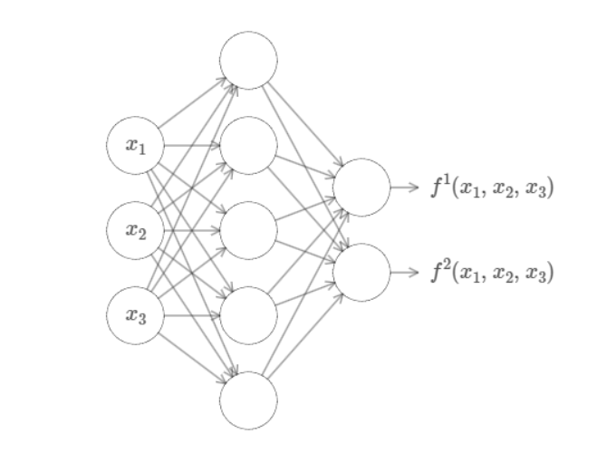

#### 原文翻译

##### 第4章 用可视化方法证明神经网络可以计算任何函数

关于神经网络最引人注目的事实之一就是它们可以计算任何函数。也就是说，假设有人给了你一些复杂的，扭曲的函数$f(x)$:

不管是什么函数都保证有一个神经网络对于每一个可能的输入$x$,都会从网络中得到一个输出值$f(x)$（或近似值）,例如：

即使这个函数有很多输入和输出，这个结果也仍然成立,$f(x)=f(x_1,x_2,...,x_m)$。例如，下面的神经网络计算的就是带有3个输入和2个输出的函数。

这个结果告诉我们神经网络具有一种普遍性。不管我们想要计算什么样的函数，我们都会想到有一个神经网络可以帮助我们计算出这个函数（或者说可以近似得到这个函数）。

更重要的是，即使我们限制我们的网络在输入和输出神经元之间只有一个中间层——一个所谓的单一隐藏层，这个普遍性定理仍然成立。因此，即使是非常简单的网络架构也可以非常强大。

普遍性定理为使用神经网络的人所熟知。但是为什么这却没有得到大众的广泛的理解。大多数的解释是相当技术性的。例如，George Cybenko (1989)的一篇原始论文证明了一个 S 函数的叠加逼近的结果。这个结果在当时是非常普遍的，而且几个小组证明了密切相关的结果[1]。Cybenko 的论文对这方面的大部分工作进行了有益的讨论。另一篇重要的早期论文是由 Kurt Hornik，Maxwell Stinchcombe 和 Halbert White (1989)提出的多层前馈网络是通用逼近器。本文利用 Stone-Weierstrass 定理得到了类似的结果。运用了哈恩-巴纳赫定理里斯表示定理和一些傅立叶变换家族中的关系。如果你是一个数学家，这个理论并不难理解，但是对于大多数人来说就不那么容易了。这是一个遗憾，因为普遍性的根本原因是简单而美丽的。

在这一章中，我给出了普遍性定理的一个简单而直观的解释。我们将一步一步地通过基本的想法。你会明白为什么神经网络可以计算任何函数。您将理解这个结果的一些局限性。你就会明白这个结果与深层神经网络之间的关系。

为了跟随本章的内容，你不需要阅读本书的前几章。相反，这一章的结构是一个独立的文章享受。只要你对神经网络有一点点基本的了解，你就应该能够理解这个解释。不过，我会偶尔提供早期材料的链接，以帮助填补您的知识空白。

普遍性定理在计算机科学中是司空见惯的，以至于我们有时会忘记它们是多么惊人。但是值得提醒自己的是: 计算任意函数的能力确实非凡。几乎你能想象到的任何过程都可以被认为是函数计算。思考一下根据一小段音乐样本来命名一段音乐的问题就可以认为是计算一个函数。或者考虑一下把中文文本翻译成英文的问题，同样，这可以被认为是计算一个函数[2]。或者考虑一下使用 mp4电影文件并生成对电影情节的描述以及对表演质量的讨论，这可以被看作是一种函数计算[3]。普遍性意味着,原则上，神经网络可以做所有这些事情和更多的事情。

当然，仅仅因为我们知道存在一个神经网络可以将中文文本翻译成英文，并不意味着我们有很好的技术来构建甚至识别这样一个网络。这种局限性也适用于布尔电路等模型的传统普适性定理。但是，正如我们在前面的书中看到的，神经网络有强大的学习功能算法。这种学习算法 + 通用性的组合是一种有吸引力的组合。到目前为止，这本书的重点是学习算法。在本章中，我们将重点讨论普遍性及其意义。

##### 两个注意事项
在解释为什么普遍性定理是正确的之前，我想提到两个非正式陈述“神经网络可以计算任何函数”的注意事项。

首先，这并不意味着网络可以用来精确地计算任何函数。相反，我们可以得到一个尽可能好的近似值。通过增加隐藏神经元的数量，我们可以提高近似值。例如，前面我举了一个用三个隐藏的神经元的网络计算函数 $f(x)$的例子。对于大多数函数来说，只有使用三个隐藏的神经元才能得到低质量的近似值。通过增加隐藏神经元的数量(比如说，增加到5个) ，我们通常可以得到一个更好的近似值:

通过进一步增加隐藏神经元的数量，我们可以做得更好。

为了使这个陈述更精确，假设我们给出了一个函数$f(x)$我们希望能够在一定的精度范围内计算 ε > 0。通过使用足够的隐藏神经元，我们总是可以找到一个神经网络的输出$g(x)$满足$|g(x)-f(x)|< ε$,对于所有的输入$x$。换句话说，对于每一种可能的输入，这种近似将在预期的精度范围内。

第二个注意事项是，这一类需要近似得到的函数必须是连续函数。如果一个函数是不连续的，例如，跳跃函数，那么通常不可能用神经网络来近似。这并不奇怪，因为我们的神经网络计算的就是输入的连续函数。然而，即使我们真正想要计算的函数是不连续的，通常情况下，连续的近似其实也足够好了。如果是这样的话，我们就可以用神经网络来近似了。在实践中，这通常不是一个重要的限制。总而言之，对于普遍性定理的一个更精确的描述是，具有单个隐层的神经网络可以用来逼近任意连续函数，达到任意期望的精度。在本章中，我们实际上将证明这个结果的一个稍微弱一点的版本，使用两个隐藏层而不是一个。在这些问题中，我将简要地概述如何通过一些调整，使解释适合于给出一个只使用一个隐藏层的证明。

##### 只有一个输入和一个输出的普遍性定理
为了理解普适性定理为什么成立，让我们从构建一个能近似得到一个函数的只有一个输入和一个输出的神经网络开始：

这就是普遍性问题的核心。一旦我们理解了这个特殊情况，实际上就很容易扩展到具有多个输入和多个输出的函数。

为了深入理解如何构建一个计算$f(x)$的网络，让我们从一个仅包含一个隐藏层、两个隐藏神经元和一个输出层包含一个输出神经元的网络开始：

为了了解网络中的组件是如何工作的，让我们把注意力集中在顶部隐藏的神经元上。在下图中，单击权重$w$，并拖动鼠标向右一点的方式来改变$w$值。你可以立即看到顶部隐藏神经元计算出的函数是如何变化的:（这里必须强烈推荐到原网站体验可视化操作界面，真的非常nice！http://neuralnetworksanddeeplearning.com/chap4.html#basic_network_precursor）

正如我们在前面学过的，被隐藏的神经元计算的是$ σ (wx + b) $[https://neuralnetworksanddeeplearning.com/chap1.html#sigmoid_neurons]，其中$ σ (z)≡\frac{1}{(1 + e^{-z})}$是sigmoid 函数。到目前为止，我们已经频繁地使用这种代数形式。但是为了证明普遍性，我们将完全忽略代数，而是操纵和观察图中所显示的形状，从而获得更多的见解。这不仅能让我们更好地了解正在发生的事情，还能证明[4]激活函数的普适性还适用于sigmoid函数以外的其他函数。

要开始进行这个证明，请尝试点击偏移值b(bias)，并向右拖动以增加它。你会看到，随着偏差的增加，图像会向左移动，但它的形状不会改变。

接下来，单击并向左拖动，以减少bias。你会看到，随着偏差的减小，图像会向右移动，但是，同样的，它的形状不会改变。

接下来，将权重w减少到2或3.你会看到，当你减小w时，曲线会变宽。您可能还需要改变b，以便将曲线保持在图像界面内。

最后，将重量增加到 w = 100以上.当你这样做时，曲线变得更陡，直到最后它看起来像一个阶跃函数。尝试调整偏置，使步长发生在 x = 0.3附近.下面的短片显示了您的结果应该是什么样子。点击播放按钮播放(或重播)视频:http://neuralnetworksanddeeplearning.com/chap4.html#basic_network_precursor

我们可以通过大幅度增加权重来简化分析，使得输出实际上是一个阶跃函数，达到一个非常好的近似值。下面我绘制了顶部隐藏神经元权重为 w = 999时的输出。请注意，此图是静态的，您不能更改参数，如权重。

#### 文章注解
[1]: S 函数的叠加逼近，[https://link.springer.com/article/10.1007/BF02551274]George Cybenko (1989)。这个结果在当时是非常普遍的，而且几个小组证明了密切相关的结果。Cybenko 的论文对这方面的大部分工作进行了有益的讨论。另一篇重要的早期论文是由 Kurt Hornik，Maxwell Stinchcombe 和 Halbert White (1989)提出的多层前馈网络是通用逼近器。[https://www.sciencedirect.com/science/article/abs/pii/0893608089900208]本文利用 Stone-Weierstrass 定理得到了类似的结果。
[2]实际上，计算许多函数中的一个，因为给定文本通常有许多可接受的翻译。
[3]关于翻译的备注和可能的功能更多的事项。
[4]严格来说，我所采用的视觉方法并不是传统意义上的证明。但是我相信视觉方法比传统的证明更能洞察为什么结果是真实的。当然，这种洞察力是证明背后的真正目的。有时候，在我提出的推理中会有一些小的空白: 在那些地方，我提出了一个看似合理但并不十分严谨的论点。如果这让你感到困扰，那么就把填补缺失的步骤视为一个挑战。但是不要忽视真正的目的: 理解为什么普遍性定理是正确的。

#### 日积月累
1. universality
美: [Nan]
英: [ˌju:nɪvɜ:'sælətɪ]
n.	普遍性；一般性；共相
网络:	普适性；通用性；性原则
例句：Perhaps I was trying to impress him with my precocious wisdom and the large universality of my interests.
或许，我想用我早熟的智慧与广博的兴趣给他留下深刻的印象。
2. theorem
美: [ˈθiərəm]
英: [ˈθɪərəm]
n.	（尤指数学）定理
网络：	原理；法则；定律
词形：theorems
例句：With Kuratowski's theorem, there is at least a criterion to use in discussing the nonplanarity of a graph.
有了库拉图夫斯基定理，在讨论一个图的非平面性时，至少就有了一个判别准则可供使用。

3. commonplace
美: [ˈkɑmənˌpleɪs]
英: [ˈkɒmənˌpleɪs]
n.	老生常谈；常见的事；平常的事；平淡无奇的言语等
adj.	平凡的；普通的；普遍的
v.	把…记入备忘录；由备忘录中摘出
网络:	陈腐的；平常话；凡庸
词形：commonplaces
Over the next year or two, this sort of technology is expected to become more commonplace, but it will also raise questions about privacy.
未来的一两年，我们期待这类技术变的更加普遍，当然它也带来了隐私类的问题。

4. arbitrary
美: [ˈɑrbɪˌtreri]
英: [ˈɑː(r)bɪtrəri]
adj.	任意的；武断的；随心所欲的；专横的
网络:	专断的；随意的；任意角度
This was the sort of arbitrary decision that no doubt cooled any enthusiasm he might have had for the new regime.
这种专断的决定毫无疑问扑灭了赫亚兹对新政权可能会有的热情。

5. circuit
美: [ˈsɜrkɪt]
英: [ˈsɜː(r)kɪt]
n.	回路；圈；巡回；(某一范围的)周边一圈
v.	(绕…)环行
网络:	电路；电路中；电路板
词形：circuits circuited circuiting
The standard nature of these processes permits us to engage independent silicon foundries to fabricate our integrated circuits.
这些工艺的标准性使得我们可以利用单独的硅制造厂生产集成电路。

6. caveat
美: [ˈkeɪviˌæt]
英: ['keɪvi.æt]
n.	警告；【法】中止诉讼的申请；〈美〉保护发明特许权的请求书
网络	注意事项；禁令；警告说明
词形：caveats
We also list the caveats that must be considered when deciding whether or not autophagy is an important effector mechanism of cell death.
我们还列出了那些必须被考虑的注意事项，以便确定细胞自噬是不是一种细胞死亡的重要效应机制。

7.precise
美: [prɪˈsaɪs]
英: [prɪ'saɪs]
adj.	准确的；确切的；精确的；明确的
网络：	一丝不苟的；精密；精准
A precise calculagraph is usually applied to any technical fields as athletic competition that demands accurate timing.
高精度计时器常用于体育竞赛及各种要求有较精确定时的技术领域。