#### 原文翻译
##### 第6章 深度学习
在上一章中，我们了解到，深度神经网络通常比浅层神经网络更难训练。这很不幸，因为我们有充分的理由相信，如果我们能够训练深度神经网络，它们将比浅层神经网络更加强大。但尽管上一章的消息令人沮丧，我们不会让它阻止我们。在本章中，我们将开发可以用于训练深度网络的技术，并将其应用于实践。我们还将审视更广阔的画面，简要回顾最近在使用深度神经网络进行图像识别、语音识别和其他应用方面取得的进展。我们还将简要推测未来神经网络和人工智能可能带来的变化。

这一章很长。为了帮助您导航，让我们来看看。这些部分只是松散地耦合在一起，所以只要您对神经网络有一定的基础了解，就可以跳转到您最感兴趣的内容。

本章的主要部分是介绍最广泛使用的深度网络类型之一：深度卷积网络。我们将通过一个详细的示例（代码和所有内容）使用卷积网络来解决从 MNIST 数据集中对手写数字进行分类的问题：
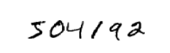

我们将从本书前面用来解决这个问题的浅层网络开始介绍卷积网络。通过多次迭代，我们将建立越来越强大的网络。我们将探索许多强大的技术：卷积、池化、使用 GPU 进行比浅层网络更多的训练、训练数据的算法扩展（以减少过度拟合）、使用 dropout技术（也可以减少过度拟合）、网络集成的使用等等。结果将是一个提供接近人类性能的系统。在 10,000 张 MNIST 测试图像中 - 训练期间未看到的图像！ - 我们的系统将正确分类 9,967。下面是 33 张被错误分类的图像。请注意，正确的分类位于右上角；我们的程序分类在右下角：
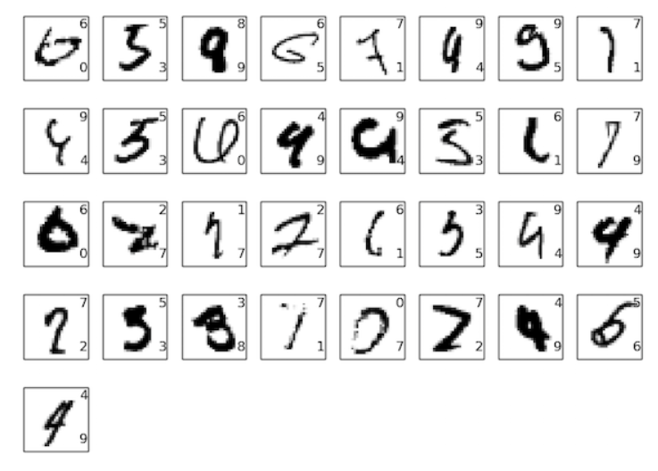

其中许多即使对于人类来说也很难分类。例如，考虑顶行中的第三张图像。对我来说，它看起来更像是“9”而不是“8”，这是官方分类。我们的网络也认为它是“9”。这种“错误”至少是可以理解的，甚至是值得赞扬的。我们通过对最近使用网络（特别是卷积网络）进行图像识别的一些惊人进展的调查来结束对图像识别的讨论。

本章的其余部分从更广泛和不太详细的角度讨论深度学习。我们将简要介绍神经网络的其他模型，例如循环神经网络和长短期记忆单元，以及如何将这些模型应用于语音识别、自然语言处理和其他领域的问题。我们将推测神经网络和深度学习的未来，从意图驱动的用户界面等想法到深度学习在人工智能中的作用。

本章以本书前面的章节为基础，利用并整合了反向传播、正则化、softmax 函数等思想。但是，要阅读本章，您无需详细阅读前面的所有章节。不过，阅读有关神经网络基础知识的第一章会有所帮助。当我使用第 2 章到第 5 章中的概念时，我会提供链接，以便您在必要时熟悉。

值得注意的是这一章不是什么。这不是关于最新和最好的神经网络库的教程。我们也不会训练具有数十层的深度网络来解决最前沿的问题。相反，重点是理解深度神经网络背后的一些核心原理，并将它们应用到简单、易于理解的 MNIST 问题中。换句话说：本章不会把你带到前沿。相反，本章和前面几章的目的是关注基础知识，以便让您做好了解当前广泛工作的准备。

##### 卷积网络简介
在前面的章节中，我们教我们的神经网络很好地识别手写数字的图像：
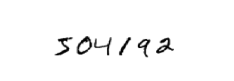

我们使用相邻网络层彼此完全连接的网络来做到这一点。也就是说，网络中的每个神经元都连接到相邻层中的每个神经元：
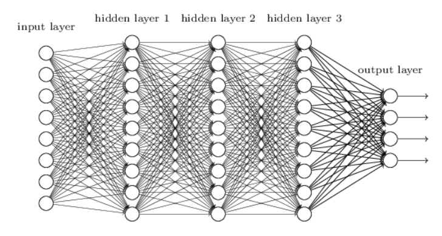

特别是，对于输入图像中的每个像素，我们将像素的强度编码为输入层中相应神经元的值。对于我们一直使用的 28×28像素图像，这意味着我们的网络具有 784 ( =28×28 ) 输入神经元。然后我们训练网络的权重和偏差，以便网络的输出能够——我们希望如此！ - 正确识别输入像：'0'、'1'、'2'、...、'8' 或 '9'。

我们早期的网络运行得非常好：使用 MNIST 手写数字数据集的训练和测试数据，我们获得了高于 98% 的分类准确率。但转念一想，使用全连接层的网络来对图像进行分类是很奇怪的。原因是这样的网络架构没有考虑图像的空间结构。例如，它以完全相同的方式处理相距较远和靠得很近的输入像素。这些空间结构的概念必须从训练数据中推断出来。但是，如果我们不是从白板的网络架构开始，而是使用试图利用空间结构的架构呢？在本节中，我将描述卷积神经网络[1]*。这些网络使用特殊的架构，特别适合对图像进行分类。使用这种架构可以快速训练卷积网络。这反过来又可以帮助我们训练深层的多层网络，这些网络非常擅长对图像进行分类。如今，大多数神经网络都使用深度卷积网络或某些近似变体进行图像识别。

卷积神经网络使用三个基本思想：局部感受野、共享权重和池化。让我们依次看看这些想法。

局部感受野：在前面显示的全连接层中，输入被描绘为神经元的垂直线。在卷积网络中，将输入视为 28×28 神经元正方形会有所帮助，其值对应于我们用作输入的 28×28 像素强度：
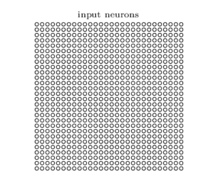
[卷积网络中输入神经元呈矩阵排列，而不是线性排列（全连接层的神经网络输入）]

像往常一样，我们将输入像素连接到隐藏神经元层。但我们不会将每个输入像素连接到每个隐藏神经元。相反，我们只在输入图像的小局部区域中建立连接。

更准确地说，第一个隐藏层中的每个神经元将连接到输入神经元的一小部分区域，例如 5×5 区域，对应于 25 输入像素。因此，对于特定的隐藏神经元，我们可能有如下所示的连接：
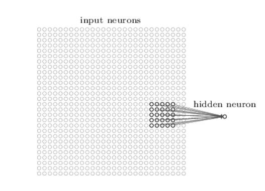

输入图像中的该区域称为隐藏神经元的局部感受野。这是输入像素的一个小窗口。每个连接都会学习一个权重。隐藏的神经元也会学习整体偏差。您可以将特定的隐藏神经元视为学习分析其特定的局部感受野。

然后，我们将局部感受野滑动到整个输入图像上。对于每个局部感受野，第一个隐藏层中有一个不同的隐藏神经元。为了具体说明这一点，我们从左上角的局部感受野开始：
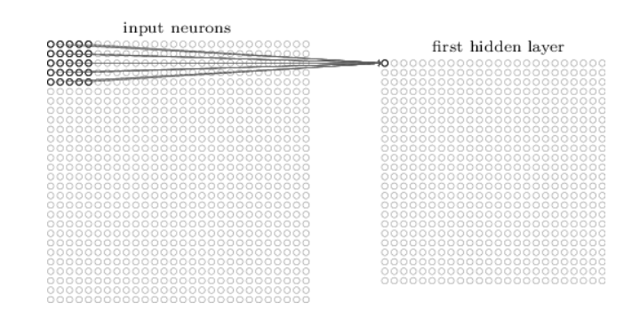

然后我们将局部感受野向右滑动一个像素（即一个神经元），以连接到第二个隐藏神经元：
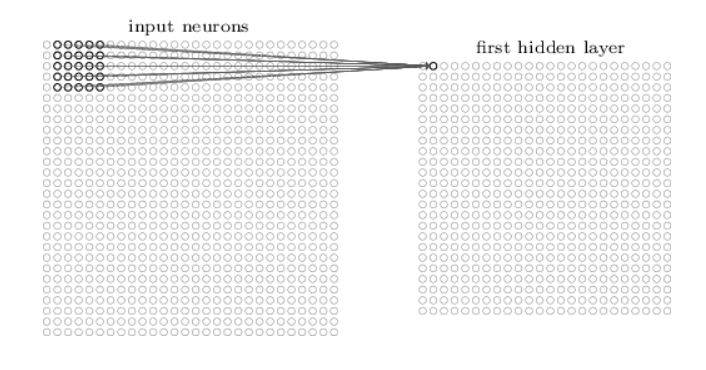

依此类推，构建第一个隐藏层。请注意，如果我们有一个 28×28 输入图像和 5×5 局部感受野，那么隐藏层中将会有 24×24 个神经元。这是因为在与输入图像的右侧（或底部）碰撞之前，我们只能将局部感受野 23 神经元跨过（或 23 神经元向下）移动。

我已经展示了局部感受野一次移动一个像素。事实上，有时会使用不同的步幅长度。例如，我们可以将局部感受野 2 像素向右（或向下）移动，在这种情况下，我们会说使用 2 的步幅长度。在本章中，我们将主要坚持使用步幅 1 ，但值得注意的是，人们有时会尝试不同的步幅[2]*

共享权重和偏差：我说过每个隐藏神经元都有一个偏差和连接到其局部感受野的 5×5 权重。我还没有提到的是，我们将为每个 24×24 隐藏神经元使用相同的权重和偏差。换句话说，对于第 j,k 个隐藏神经元，输出为：
$$σ(b+∑_{l=0}^4∑_{m=0}^4w_{l,_m}a_{j+l,k+m})，(125)$$

这里， σ 是神经激活函数——也许是我们在前面的章节中使用的 sigmoid 函数。 b 是偏差的共享值。 $w_{l,m}$ 是共享权重的 5×5 数组。最后，我们使用 $a_{x,y}$ 表示位置 $x,y$ 处的输入激活。

这意味着第一个隐藏层中的所有神经元检测到完全相同的特征[3]*。

只是在输入图像中的不同位置。为了理解为什么这是有意义的，假设权重和偏差使得隐藏神经元可以挑选出特定局部感受野中的垂直边缘。这种能力也可能在图像的其他地方有用。因此，在图像中的各处应用相同的特征检测器是很有用的。用更抽象的术语来说，卷积网络很好地适应了图像的平移不变性：将猫的图片稍微移动一点，它仍然是猫的图像*

因此，我们有时将输入层到隐藏层的映射称为特征映射。我们将定义特征图的权重称为共享权重。我们将这种方式定义特征图的偏差称为共享偏差。共享权重和偏差通常被认为定义了内核或过滤器。在文献中，人们有时会以稍微不同的方式使用这些术语，因此我不会更精确；相反，稍后我们将看一些具体的例子。

到目前为止我描述的网络结构只能检测一种局部特征。为了进行图像识别，我们需要多个特征图。因此，一个完整的卷积层由几个不同的特征图组成：
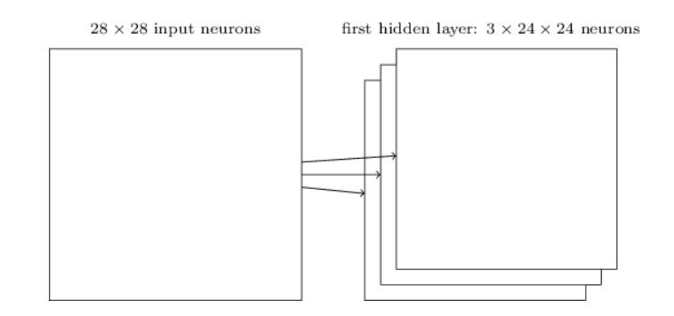

为了使上图保持简单，我只显示了 3 特征图。然而，在实践中，卷积网络可能会使用更多（也许更多）的特征图。早期的卷积网络之一 LeNet-5 使用 6 特征图（每个特征图与一个 5×5 局部感受野相关联）来识别 MNIST 数字。所以上面的例子实际上非常接近 LeNet-5。在本章后面开发的示例中，我们将使用带有 20 和 40 特征图的卷积层。让我们快速浏览一下所学到的一些功能[4]*:
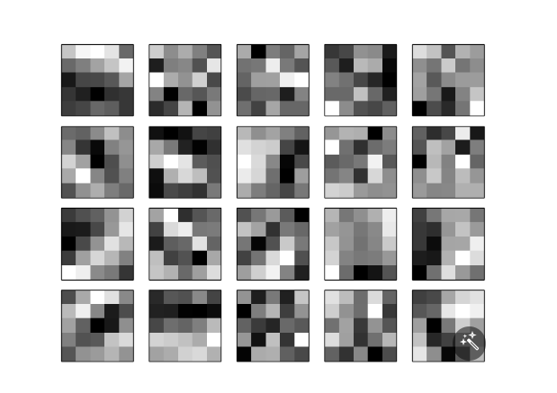

这20张  图像对应于 20 不同的特征图（或过滤器或内核）。每个图都表示为 5×5 块图像，对应于局部感受野中的 5×5 权重。更白的块意味着更小的（通常是更负的）权重，因此特征图对相应输入像素的响应更少。较暗的块意味着较大的权重，因此特征图对相应输入像素的响应更大。粗略地说，上面的图像显示了卷积层响应的特征类型。

那么我们可以从这些特征图中得出什么结论呢？很明显，这里的空间结构超出了我们随机预期的范围：许多特征都有清晰的明暗子区域。这表明我们的网络确实正在学习与空间结构相关的东西。然而，除此之外，很难看出这些特征检测器正在学习什么。当然，我们并不是在学习（比如说）Gabor 滤波器，它已被用于许多传统的图像识别方法中。事实上，现在有很多工作致力于更好地理解卷积网络学到的特征。如果您有兴趣跟进这项工作，我建议您从 Matthew Zeiler 和 Rob Fergus 撰写的论文《可视化和理解卷积网络》（2013 年）开始。

共享权重和偏差的一大优点是它大大减少了卷积网络中涉及的参数数量。对于每个特征图，我们需要 25=5×5 共享权重，以及单个共享偏差。所以每个特征图都需要 26 参数（25个weight和一个bias）。如果我们有 20 个特征图（特征可以理解为输入变量x），那么定义卷积层的参数总数就是 20×26=520 个(每张输入都有26个参数)。相比之下，假设我们有一个完全连接的第一层，具有 784=28×28 输入神经元和相对适度的 30 隐藏神经元（自定义），正如我们在本书前面的许多示例中所使用的那样。总共有 784×30 个权重（每个输入连接在同一个神经元上就有784×1个权重，30个神经元就有784×30个权重），加上额外的 30 偏差，总共有 23,550 个参数。换句话说，全连接层的参数数量是卷积层的 40 倍以上。（可想而知，这种参数量想调节参数是非常繁琐，而卷积神经网络之所以参数少的原因是独特的特征处理方式：局部视野，共享权重和共享偏差，一张图片使用相同的权重和偏移值（二者的结合也可叫滤波器，就是一个扫描提取特征用的矩阵），处理一次的特征只是给原有的输入矩阵进行了一次“瘦身”，因此，卷积神经网络据此来看，卷积层后的隐藏层的神经元数量只会比前面少。）

当然，我们无法真正对参数数量进行直接比较，因为这两个模型在本质上是不同的。但是，直观上来说，卷积层使用**平移不变性**似乎会减少获得与全连接模型相同性能所需的参数数量。反过来，这将加快卷积模型的训练速度，并最终帮助我们使用卷积层构建深度网络。

顺便说一句，“卷积”这个名称来自于方程（125）中的运算有时被称为卷积的事实。更准确地说，人们有时将该方程写为$ a^1=σ(b+w∗a^0) $，其中 $a^1$ 表示来自一个特征图的输出激活集， a$^0$ 是输入集激活， ∗ 称为卷积运算。我们不会深入使用卷积数学，因此您无需太担心这种连接。但至少值得知道这个名字的来源。

池化层：除了刚才描述的卷积层之外，卷积神经网络还包含池化层。池化层通常紧接在卷积层之后使用。池化层的作用是简化卷积层输出中的信息。(竟然还能再简化！！！！)

具体来说，池化层获取每个特征图[5]*,

卷积层的输出并准备一个压缩的特征图。例如，池化层中的每个单元可以总结前一层中的（比如说） 2×2 神经元的区域。作为一个具体示例，池化的一种常见过程称为最大池化。在最大池化中，池化单元仅输出 2×2 输入区域中的最大激活值(4个值里面选个最大的值)，如下图所示：
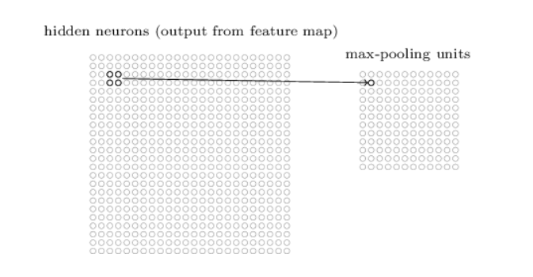

请注意，由于我们有从卷积层输出的 24×24 个神经元，因此池化后我们有 12×12 个神经元。（很好算，24×24×1/4=12×12）

如上所述，卷积层通常涉及多个特征图。我们分别对每个特征图应用最大池化。因此，如果存在三个特征图，组合的卷积层和最大池层将如下所示：
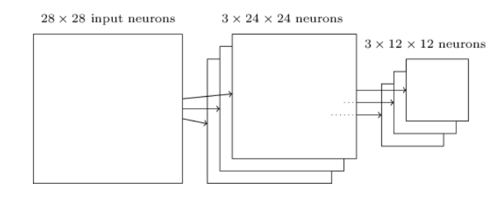
[看懂此图那一刻，真是觉得这图太美了!]

我们可以将最大池化视为网络询问是否在图像区域中的任何位置找到给定特征的一种方式。然后它会丢弃确切的位置信息。直觉是，一旦找到某个要素，其确切位置并不像其相对于其他要素的粗略位置那么重要。一个很大的好处是池化特征要少得多，因此这有助于减少后面层所需的参数数量。

最大池化并不是唯一用于池化的技术。另一种常见的方法称为 L2 池化。在这里，我们不是取神经元 2×2 区域的最大激活值，而是取 2×2 区域中激活值平方和的平方根。虽然细节不同，但直观上与max-pooling 类似：L2 池化是一种压缩来自卷积层的信息的方法。在实践中，这两种技术都得到了广泛的应用。有时人们会使用其他类型的池化操作。如果您确实想优化性能，则可以使用验证数据来比较几种不同的池化方法，并选择最有效的方法。但我们不会担心那种详细的优化。

将它们放在一起：我们现在可以将所有这些想法放在一起，形成一个完整的卷积神经网络。它与我们刚刚看到的架构类似，但添加了一层 10 输出神经元，对应于 MNIST 数字的 10 可能值（'0'、' 1'、'2' 等）：
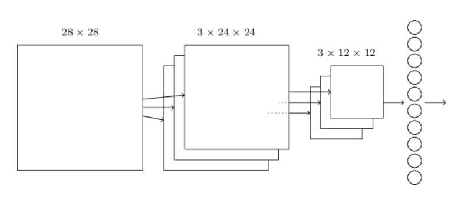

该网络从 28×28 输入神经元开始，这些神经元用于对 MNIST 图像的像素强度进行编码。然后是使用 5×5 局部感受野和 3 特征图的卷积层。结果是一层 3×24×24 隐藏特征神经元。下一步是最大池化层，应用于每个 3 特征映射的 2×2 区域。结果是一层 3×12×12 隐藏特征神经元。

网络中的最后一层连接是全连接层。也就是说，这一层将来自最大池层的每个神经元连接到每个 10 输出神经元。这种全连接架构与我们在前面章节中使用的相同。但请注意，在上图中，为简单起见，我使用了单个箭头，而不是显示所有连接。当然，你可以很容易想象其中的联系。

这种卷积架构与前面章节中使用的架构有很大不同。但整体情况是相似的：一个由许多简单单元组成的网络，其行为由它们的权重和偏差决定。总体目标仍然是相同的：使用训练数据来训练网络的权重和偏差，以便网络很好地对输入数字进行分类。

特别是，就像本书前面一样，我们将使用随机梯度下降和反向传播来训练我们的网络。这主要以与前面章节完全相同的方式进行。然而，我们确实需要对反向传播过程进行一些修改。原因是我们之前的反向传播推导是针对具有全连接层的网络。幸运的是，修改卷积层和最大池层的推导非常简单。如果您想了解详细信息，那么我邀请您解决以下问题。请注意，解决这个问题需要一些时间，除非您真正内化了反向传播的早期推导（在这种情况下很容易）。

##### 问题
卷积网络中的反向传播 全连接层网络中反向传播的核心方程是 (BP1)-(BP4)[http://neuralnetworksanddeeplearning.com/chap2.html#backpropsummary]假设我们有一个包含卷积层、最大池层和全连接输出层的网络，如上面讨论的网络所示。反向传播方程如何修改？

##### 卷积神经网络实践
[http://neuralnetworksanddeeplearning.com/chap6.html#convolutional_neural_networks_in_practice]

##### 论神经网络的未来
未来已来。[http://neuralnetworksanddeeplearning.com/chap6.html#on_the_future_of_neural_networks]

#### 注释说明
* [1]卷积神经网络的起源可以追溯到 20 世纪 70 年代。但建立现代卷积网络学科的开创性论文是 1998 年的一篇论文，“基于梯度的学习应用于文档识别”，作者为 Yann LeCun、Léon Bottou、Yoshua Bengio 和 Patrick Haffner。此后，LeCun 对卷积网络的术语做了有趣的评论：“卷积网络等模型中的[生物]神经灵感非常脆弱。这就是为什么我称它们为‘卷积网络’而不是‘卷积神经网络’，也是为什么我们称它们为‘卷积网络’而不是‘卷积神经网络’。节点“单元”而不是“神经元””。尽管有这样的评论，卷积网络使用了许多与我们迄今为止研究的神经网络相同的思想：诸如反向传播、梯度下降、正则化、非线性激活函数等思想。因此，我们将遵循常见的做法，并将它们视为一种神经网络。我将互换使用术语“卷积神经网络”和“卷积网络（工作）”。我还将交替使用术语“[人工]神经元”和“单元”。
* [2]正如前面章节中所做的那样，如果我们有兴趣尝试不同的步幅长度，那么我们可以使用验证数据来挑选提供最佳性能的步幅长度。有关更多详细信息，请参阅前面关于如何在神经网络中选择超参数的讨论。同样的方法也可以用于选择局部感受野的大小 - 当然，使用 5×5 局部感受野没有什么特别的。一般来说，当输入图像明显大于 28×28 像素 MNIST 图像时，较大的局部感受野往往会有所帮助。
* [3]我还没有精确定义特征的概念。非正式地，将隐藏神经元检测到的特征视为将导致神经元激活的输入模式：例如，它可能是图像中的边缘，也可能是其他类型的形状。
* [4]所示的特征图来自我们训练的最终卷积网络，请参见此处。
* [5]此处使用的术语很宽松。特别是，我使用的“特征图”不是指卷积层计算的函数，而是指该层输出的隐藏神经元的激活。这种对术语的轻微滥用在研究文献中很常见。
#### 日积月累